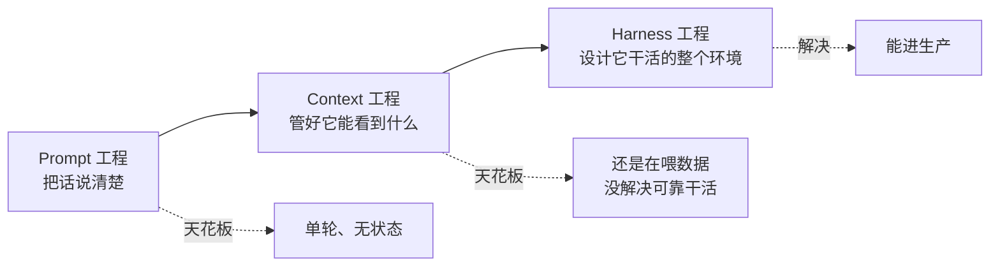
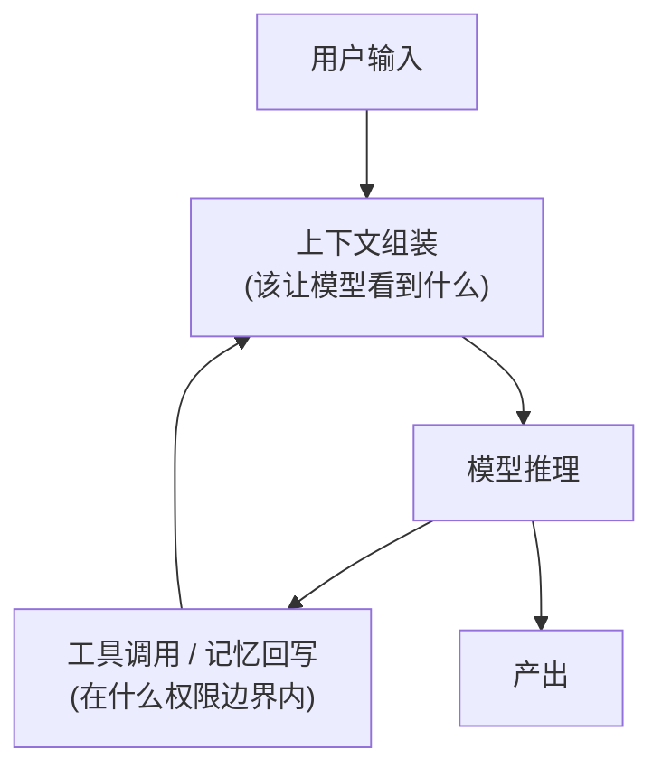
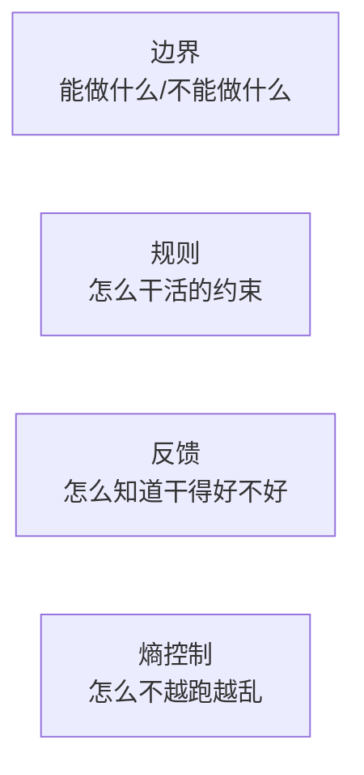

# E1｜重新理解 Agent:为什么用了最强模型,产品还是不如对手

> 草稿版本:v1 · 状态:✍️ 草稿中 · 字数目标:6000-8000
>
> 🖊️ 占位说明:文中 `【待补·一手观察】` 标记处,需要你填入自己高强度使用 Claude Code / Cursor / Codex 等产品的**真实体验**。这是求职作品集的核心信号,我不代写,只搭好上下文。

---

## 本文回答这些问题

1. **同一个任务,我该用 Claude Code 直接跑,还是自己搭一套 Agent 系统?** 判断依据是什么?
2. **我的业务该接 API 模式、桌面端 Agent、还是 IDE 插件?** 怎么分析,而不是拍脑袋?
3. **跟老板讲"我们要做 Agent 化改造",ROI 怎么算才诚实?**
4. **为什么 Demo 跑得好,一放进真实项目就翻车?** 这个鸿沟到底在哪?
5. **做 Agent 产品,PM 的工作方式和做传统软件有什么本质不同?**

这五个问题,是任何一个团队真正动手做 Agent 时,绕不开的头五个坑。这篇不讲"Agent 是什么"的定义,只讲你撞上这些问题时该怎么判断。

---

## 开篇:一个反直觉的现象

先说一个我反复看到的现象:

> 两个团队做同类 AI 产品。A 团队用了市面上最强的模型,B 团队用了差一档的模型。结果 B 的产品体验明显更好——更少胡说、更少卡死、更敢放手让它干活。

如果你相信"模型决定一切",这个现象无法解释。但它在真实世界里反复发生。阿里一个团队把同一个应用的 AI Coding 率从 **24.86% 拉到 90.54%**,靠的不是换模型,而是重做了模型外面那一整套东西。腾讯一个团队让 6 个 AI Agent 连写 4 天代码,烧掉 **4 亿 token**,换来的是 5 个血淋淋的教训——问题也几乎都不在模型本身。

这套"模型外面的东西",就是本系列的主角:**Harness(运行框架)**。

本文的核心论断,一句话:

> **Agent = Model + Harness,且 Harness > Model。**
> 模型决定 Agent 的能力**上限**,Harness 决定 Agent 在真实场景下的**实际表现**。
> 而 PM 真正能影响产品质量的杠杆,不在选模型,在设计 Harness。

这篇文章要做两件事:把这个心智装进你脑子(立论),再给你一张能拆解**任何** Agent 产品的地图(框架)。后面 8 篇,都是这张地图的展开。

---

## 一、三次范式跃迁:Prompt → Context → Harness

要理解 Harness 为什么重要,先看 AI 应用这几年走过的三级台阶。

**第一级 · Prompt 工程**:核心是"把话说清楚"——身份、角色、语气、任务步骤。它的天花板很明显:单轮对话、无状态、说完就忘。

**第二级 · Context 工程**:核心是"管好 Agent 每一轮能看到什么"——文件注入、历史召回、上下文压缩、资源挂载。它比 Prompt 进了一大步,但天花板还是存在:你还是在"喂数据",并没有解决"它能不能在真实环境里可靠地、长时间地、安全地干完活"。

**第三级 · Harness 工程**:核心是"设计 Agent 干活的整个环境"——权限边界、工具系统、记忆、失败恢复、熵控制。

中文社区有一句话把这三级的关系说得最精准:

> **Prompt 只是入口,Context 决定可用度,Harness 决定能不能进生产。**

这句话值得你记住,因为它直接回答了本文的 **Q5(PM 工作方式之变)**:

在 Prompt 时代,PM 的工作是写好需求文档;到了 Harness 时代,PM 的工作变成了**设计 Agent 能在什么边界里、用什么工具、带着什么记忆、出错了怎么恢复地可靠干活**。不再是"写清楚要什么",而是"设计一套让 AI 能稳定交付的工作环境"。

> 🖊️【待补·一手观察】这里放一段你自己的体会:你第一次意识到"问题不在 prompt 而在 harness"是什么场景?比如你把同一个任务在 Claude Code 和直接调 API 里各跑一遍,差异具体体现在哪?(WRITING-GUIDE 要求全文 ≥3 处这样的原创判断,这是第 1 处)

---

## 二、Harness 不是框架,是 Agent 的操作系统

很多人把 Harness 理解成"一个 Agent 框架/SDK"。这个理解会让你低估它。

更准确的类比是:**Harness 是 Agent 的操作系统。**

操作系统管什么?管进程调度、内存分配、文件 IO、权限控制——它决定了应用程序能不能稳定运行。Harness 管的是同一类事,只是对象换成了 Agent:

> 📌 这张图是简化版主干。完整版——包括上下文怎么分段、怎么压缩、怎么命中缓存——是一张信息量极大的"上下文生命周期图",我们留到 **E4** 专门拆。这里你只需要记住:从你按下回车,到模型给出答复,中间有一整套"操作系统级"的调度在运转。

这个视角直接回答了本文的 **Q1(用现成产品还是自建)**:

- **Claude Code / Cursor / Codex 这类产品,等于一个"操作系统已经焊死"的设备。** 它们的 Harness 是固定的,你只能在它给的边界里用。
- **自建 Agent 系统,等于你能改这套操作系统。** 你能定制工具集、权限模型、记忆结构、编排逻辑。

所以判断界限不是"哪个更好",而是一个问题:

> **你的业务,需不需要改动"操作系统"级的东西?**
> 如果你的任务用现成产品的工具、权限、记忆就能跑好——直接用,自建是浪费。
> 如果你的任务需要接入私有系统、定制权限分级、设计专属记忆结构——那现成产品的固定 Harness 会成为天花板,这时候才值得自建。

> 🖊️【待补·一手观察】第 2 处原创判断:你自己有没有遇到过"现成产品的 Harness 卡住了我"的具体场景?比如 Claude Code 的某个默认行为不符合你的需求、想改却改不动?

---

## 三、五大组件:一把能拆解任何 Agent 的尺子

这是本文最有用的产出。如果你只带走一样东西,带走这张表。

任何一个 Agent 产品,都可以拆成五大组件来看。拆完,你就能定位它强在哪、弱在哪、和对手的差异在哪:

| 组件 | 它解决的问题 | 一句话判断标准 | 哪一期细讲 |
|------|------------|--------------|-----------|
| **编排循环** | 任务怎么"跑起来"又不跑飞 | 它会不会陷入死循环?崩了能不能续跑? | E2 |
| **工具系统** | 怎么让 Agent 调对、调安全 | 工具多了它会不会选错?失败了怎么处理? | E3 |
| **上下文与记忆** | 一次对话到底带着什么、怎么省 token | 它记不记得上次说的话?上下文满了怎么办? | E4 |
| **能力组织** | 能力多了、任务大了怎么拆 | 复杂任务它会不会拆?多个 Agent 怎么协作? | E5 |
| **安全与权限** | 怎么既放手又不闯祸 | 哪些操作敢自动、哪些必须人工确认? | E6 |

> 这套"五大组件"是面向产品沟通的粗粒度切法。社区还有更细的版本:腾讯把它拆成 6 类抓手(权限/工具/技能/上下文/记忆/运行保障),学术界的 *Agent Harness Engineering: A Survey* 进一步提出 **ETCLOVG 七层**(执行/工具/上下文/生命周期/可观测/验证/治理)。做竞品拆解、上线检查时,可以升级到七层清单;对外讲清楚产品,五大组件够用。

这张表也回答了本文的 **Q2(选 API / 桌面 / IDE)**:

选型的本质不是看品牌,是看**你的任务在这五个组件上,各自需要多重**:

- 任务要触达很多外部系统 → **工具系统**是重点 → 倾向能自定义 MCP 的形态
- 任务是长周期、跨会话的 → **上下文与记忆**是重点 → 桌面端 Agent 比无状态 API 更合适
- 任务涉及生产环境操作 → **安全与权限**是重点 → 需要细粒度权限分级的产品

一句话:**先用五大组件给你的任务"称重",再选形态,而不是反过来。**

---

## 四、桌面端 Agent 全景速览:9 款产品,各自押注了什么

> 这一节只做"一句话定位"的速览。每一款的深度拆解,会出现在后面对应的章节里。先建立全景,再逐个深挖。

| 产品 | 一句话定位(哲学) | 押注的核心组件 |
|------|------------------|--------------|
| **Claude Code** | "笨循环"哲学——把秩序放进 Harness 运行时,纪律内化 | 编排循环 + 权限/Hook/子 Agent |
| **Codex** | 极简主义——把规矩放在系统外沿,制度外化(App Server/线程持久化) | 生命周期 + 跨端复用 |
| **Cursor** | 从编辑器进化到 Agent Mode,人机协作的"接受/拒绝"体验 | 工具系统 + 交互 |
| **GitHub Copilot** | 从补全到 Agent 的转身,吃 IDE 生态红利 | 工具系统 + 集成 |
| **OpenClaw** | 模块化 Prompt + Markdown 文件注入,面向个人的 Agent Harness | 上下文注入 + 跨渠道 |
| **OpenCode** | 开源阵营的反击,可改可定制 | 自建友好 |
| **Manus** | 面向通用任务的自主 Agent 探索 | 编排 + 长任务 |
| **Hermes** | 自进化路线——把经验回流进模型训练闭环 | 共同进化(见 E7) |
| **Cowork** | 面向协作场景的通用任务 Agent | 多端协作 |

> 🖊️【待补·一手观察】第 3 处原创判断,也是这一节的灵魂:挑 2-3 款你**真正高强度用过**的产品,each 写一句"我用下来,它最让我意外/最难受的一点是……"。招聘方一眼就能分辨这是真用过,还是综述别人的概念。
>
> 校对提醒:Cursor / Copilot / OpenCode / Cowork / Manus 的定位表述,建议动笔定稿前和 `wiki/entities/` 里的档案核对(其中 Cowork/OpenCode/Copilot 目前还没有独立档案,是 E1 的素材缺口)。

### 这一节顺便回答 Q3 和 Q4

**Q3(ROI 怎么算才诚实)**:别只讲成功故事。把两个真实数字放在一起,才是诚实的 ROI 框架——

- **成功路径**:阿里某团队把 AI Coding 率从 24.86% 做到 90.54%(靠 AGENTS.md + Spec + 工具化环境 + 测试门禁 + 多 Agent 评审的完整闭环)。
- **踩坑路径**:腾讯让 6 个 Agent 连写 4 天代码、烧掉 4 亿 token,换来 5 个教训。

> 给老板讲 ROI,要同时给这两个数。只讲 90% 是骗人,只讲 4 亿 token 是吓人。**真实的 ROI = 上限收益 × 你的 Harness 成熟度。** Harness 不成熟时,投入越大,翻车越惨。

**Q4(Demo 好、生产翻车的鸿沟)**:这个鸿沟有一个朴素的公式(来自 QQ 音乐的 Harness 实践):

> **代码产出 = AI 能力 × 上下文质量。**

Demo 翻车,几乎都是因为"上下文质量"这一项在真实项目里崩了:Demo 里上下文小而干净,真实项目里代码库巨大、规则复杂、历史混乱。模型能力没变,但乘上一个糟糕的上下文质量,结果就崩。这正是为什么本系列要花整整一篇(E4)讲上下文与记忆——它是 Demo 到生产那道鸿沟的主战场。

> 详见 `wiki/lessons/prompt-only-agent-is-not-production.md`:只靠 prompt 的 Agent 为什么进不了生产。

---

## 五、Harness Engineer 的能力模型 + 收尾

如果"Harness 是 Agent 的操作系统",那么 Harness Engineer(以及对应的 PM)的能力,可以归到四个维度:

- **边界**:权限、沙箱、危险操作确认(E6)
- **规则**:AGENTS.md、Skills、上下文设计(E4/E5)
- **反馈**:评估、可观测性、数据驱动迭代(E8)
- **熵控制**:压缩、债务管理、模型与 Harness 协同进化(E4/E7)

中文社区喜欢用"驾驭"这个比喻:模型像一股强劲但方向不稳的能量,Harness 是缰绳、护栏和仪表盘,让它在正确的轨道上发力。这也是本系列名字的由来。

### 与工程师对话的检查清单(PM 拿着就能用)

- [ ] 我们的 Agent,用的是现成产品的"操作系统",还是自建的?这个选择论证过吗?
- [ ] 五大组件(编排/工具/上下文记忆/能力组织/安全)里,我们当前**最弱**的是哪个?
- [ ] 我们给老板的 ROI 估算,**同时**包含了成功上限和踩坑成本吗?
- [ ] 我们的 Demo 和真实环境,"上下文质量"差了多少?这道鸿沟谁来填?

### 对 DeepSeek 意味着什么

> 🖊️【待补·留白】一句话:如果 DeepSeek 要做桌面端 Agent,"Harness > Model"这个判断,意味着团队的杠杆应该压在哪里。(这条线索会在 E9 的产品提案里收口)

### 下期预告

E2《编排循环:任务怎么"跑起来"又不跑飞》——我们从"Agent 卡住的 5 种常见死法"讲起,看腾讯那 4 亿 token 是怎么烧掉的,以及四道硬闸该怎么设计。

---

<!-- 配图清单(待重绘为定稿质量):
  1. 三次范式跃迁(本文已有 Mermaid 雏形)
  2. Harness as OS 主干图(本文已有 Mermaid 雏形;完整版见 assets/harness-as-os-overview.jpg,E4 详拆)
  3. 五大组件表(已是 Markdown 表)
  4. 9 款定位速览表(已是 Markdown 表)
-->
<!-- 素材缺口:
  - Cowork / OpenCode / GitHub Copilot 的 entities 档案(wiki 暂无)
  - 3 处【待补·一手观察】+ 1 处【待补·留白】= 你的真实使用体验,本系列灵魂
-->
