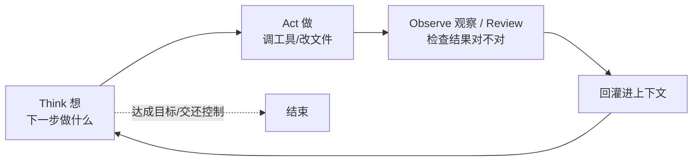
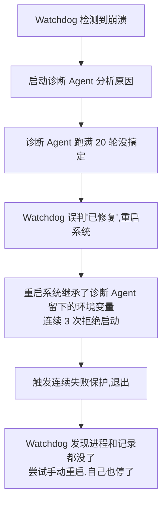

# E2｜Agent 循环与编排：任务怎么"跑起来"又不跑飞

> 草稿版本：v1 · 状态：✍️ 草稿中 · 字数目标：6000-7500
>
> 本章是全系列第一篇"硬核模块章"。E1 给了 ETCLOVG 七层地图，E2 拎出贯穿 E/T/L 的主循环单独讲透：先看一个 Agent 怎么转（第一幕·循环），再看多个怎么协同不跑飞（第二幕·编排）。

---

## 本文回答这些问题

**第一幕 · 循环（单个 Agent 怎么转）**
1. 什么是 Agent 循环？它和编排、和工具调用是什么关系？
2. 一个 Agent 的主循环具体怎么设计？
3. 让 AI 边做边想，还是先出计划再执行？

**第二幕 · 编排（多个怎么协同不跑飞）**
4. 多个 Agent 一起跑，顺序怎么排、互相踩了怎么隔离、结果冲突谁拍板？
5. 怎么让 Agent 跑起来又不跑飞？——四道硬闸 + 谁来踩刹车。
6. 崩了怎么不从头再来？断点续跑 + 让用户看得见、不焦虑。
7. 怎么用编排省钱？什么才算好的编排？

---

## 开篇：让 Agent 动起来很容易，不跑飞才是真功夫

上一篇（E1）我们说，Harness 是 Agent 的操作系统。如果把这个比喻接着用下去——**循环，就是这台机器的 CPU 怎么一拍一拍地执行；编排，就是多个任务怎么被调度。** 任务能不能"跑起来"，且在跑的时候"不跑飞"，全看这一层。

先讲个真事。腾讯一个团队搭了套系统，让 6 个 AI Agent 连写 4 天代码，烧掉了 4 亿 token。他们一开始最担心的是"prompt 写得好不好"，结果发现 Agent 本身只改了一两个版本，绝大部分精力都耗在了"怎么让这些 Agent 稳定运行"上。其中一位工程师写下这么一句话：

> 我花了大半天精心设计的"多层防御"，在真实故障面前跟多米诺骨牌一样——一推就倒。

这句话点破了本章的核心：**让一个 Agent 动起来，极其简单——一个 `while` 循环加上工具调用就行了。难的是让它在动起来之后不失控：不死循环、不跑飞、崩了能恢复、多个一起跑还不打架。**

这章分两幕。第一幕把镜头怼近，看清单个 Agent 那个圈到底怎么转；第二幕把镜头拉远，看多个 Agent、多步骤怎么被编排得不出事。那个 4 亿 token 的案例，会贯穿全章——它几乎是一座"反面教材博物馆"。

---

# 第一幕 · 循环：单个 Agent 怎么转

## 一、什么是 Agent 循环（Q1）

一句话：**Agent 循环 = 单个 Agent "想 → 做 → 看 → 再想"不断重复，直到任务完成或把控制权交还给你。** 它本质上就是一个带工具调用的 `while` 循环，而不是一问一答的聊天。

为了不和后面的概念混淆，先把三组词的边界各用一句话钉死：

- **循环 vs 工具调用**：工具调用是循环里"做"的那一下（查个文件、跑段代码）；循环是把"想-做-看"这三步串起来反复转。工具调用是动作，循环是节奏。
- **循环 vs 编排**：循环是"一个 Agent 怎么转"（微观）；编排是"多个步骤、多个 Agent，谁先谁后、谁调谁、谁等谁"（宏观）。本章先讲循环，第二幕讲编排。
- **循环/编排 vs Harness**：它们是 Harness 这台操作系统里负责"执行 + 调度"的模块，对应 E1 七层里贯穿执行（E）、工具（T）、生命周期（L）的那条主循环。
- **编排可以静态，也可以动态**：简单场景下编排是固定流程（先做 A 再做 B）；复杂场景下，编排本身可以由 Agent 在运行时动态生成——最激进的形态是 Claude 的 Dynamic Workflows：让 Agent 当场写一段 JavaScript 编排脚本去调度上百个子 Agent（这块属于多 Agent 的极致形态，E5 细讲）。越动态，越需要硬约束兜底（本章第二幕的四道硬闸、第五节的'Agent 出主意、Harness 拿决定'）。

记住这个区分，后面就不会把"工具调用失败怎么办"（那是工具层的事，E3 讲）和"循环要不要继续"（这才是循环的事）搅在一起。

## 二、一个 Agent 的主循环到底怎么设计（Q2）

很多介绍 Agent 的内容画一张 TAO 的圈就过去了。但圈谁都会画，真正决定它能不能用的，是圈上那几个开关。这一节就专门讲这几个开关。

先看骨架。Codex 官方把这个循环讲得最白：Agent 在"用户输入、模型推理、工具调用、工具结果回填"之间循环，直到生成最终回复或交还控制权。翻译成大白话就是 TAO 三步：Think（想下一步）、Act（动手做）、Observe（检查结果）。其中 Observe 这个词我们平时接触得少，其实它特别像研发同学熟悉的 **Review**——做完一步，先检查一下结果对不对、报没报错、离目标更近了没有，再决定下一步怎么走。可以把它理解成 Agent 给自己每一步做的一次"超级 Review"。

骨架很简单。但要让这个循环"能用、不出事"，有三件事必须想清楚——它们正好是圈上的三个开关：

**① 循环什么时候该停？**
循环有两种停法：一种是**正常终止**——任务做完了、产出了最终结果，或者它判断该把控制权交还给人；另一种是**异常终止**——出问题了，得强制刹车。问题在于：不能把"要不要继续"完全交给模型自己判断。模型经常会陷入"我再试一次就好了"的乐观，于是一轮一轮地空转下去。所以**停止条件必须有一部分是外部强制的**——这就是第二幕第五节"四道硬闸"的引子。这里先记住一句话：一个不会停的循环，是所有失控的起点。

**② 工具结果怎么回灌进下一轮？**
Observe 到的东西——成功的输出、报错信息、甚至是空结果——必须结构化地塞回上下文，让下一次 Think 真的"看得到"。这一步叫回灌（feedback）。回灌做得差，会出现一个典型故障：Agent 看不见上一步其实失败了，于是用同样的方式再做一遍，再失败，再做……原地打转。（注：工具结果具体怎么格式化、怎么截断，属于工具层，E3 会细讲；这里只强调"结果必须回灌进循环"这件事本身。）

**③ 单步怎么不跑偏？**
每转一圈，Agent 都得能回答两个问题：这一步还对着最初的目标吗？这一步到底有没有进展？前者防止"越走越远、忘了要干嘛"，后者防止"反复重复一个没用的动作"。一个看不见自己有没有进展的循环，就是后面那个 4 亿 token 事故的微观起点。

**一句可迁移的判断**：循环本身好写，难的是给它装上**刹车（停止条件）、仪表盘（结果回灌）、方向盘（单步防跑偏）**。光画个圈不装这三样，等于造了辆没刹车的车——在 Demo 的小路上看着没事，一上真实项目的高速就出人命。

## 三、边做边想，还是先出计划？（Q3）

主循环转起来了，马上面临第一个分叉：**让 AI 走一步看一步，还是先憋出一份完整计划再执行？**

这是两条经典路线：

- **ReAct（边想边做）**：想一步、做一步、看一步，再想下一步。灵活、适合探索性任务（我也不知道下一步该干嘛，看了结果再说）。缺点是容易"走着走着忘了目标"，也更容易陷入死循环。
- **Plan-and-Execute（先计划后执行）**：先产出一份计划，再照着一步步落地。目标稳、可审查、出问题能从某一步接管。缺点是计划一旦僵化，中途发现方向错了，返工成本高。

**怎么选？** 我的判断是看任务的两个属性：**长度**和**可控要求**。任务越长、越需要可审计、越可能要人中途接管，就越往"先出计划"靠；任务越短、越探索性，就越可以"边做边想"。现实里成熟产品大多是**混合**：先让它出一份计划（于是你能审、能改），执行过程中再允许它对单步做 ReAct 式的微调。

这里埋一个后面会用到的关键设计：**Planner 最好输出"声明式计划"（我打算做这几件事），而不是"命令式调用"（我现在就去执行）。** 区别在于：声明式计划是"建议"，最终做不做、按什么预算做，决定权留在 Harness 手里。为什么这点这么重要？第二幕第五节会用一个血淋淋的例子告诉你。

---

# 第二幕 · 编排：多个怎么协同不跑飞

现在镜头拉远。单个 Agent 的循环搞清楚了，真实生产里往往是**好几个 Agent 一起跑**。这就从"循环"进入了"编排"——谁先谁后、谁调谁、互相踩了怎么办、跑飞了谁来拦。

我们就拿那个 4 亿 token 的系统当解剖标本。它的角色设计其实相当专业：

- **Lead Agent（技术负责人）**：拆任务、分配、把关交付质量。
- **Worker ×3（开发工程师）**：在各自独立的代码副本里并行开发。
- **Gatekeeper（代码审查员）**：审查质量，决定能不能合入主分支。
- **Watchdog（系统负责人）**：每 10 分钟巡检，脚本挂了或日志异常就诊断、修复、重跑。

设计看着很完备。然后，它几乎在每一个环节都翻了车。下面四节，就是它翻车的四种方式，和正确的做法。

## 四、多 Agent 协调、隔离、冲突裁决（Q4）

**先说清边界**：这一节默认任务"已经拆好了"。一个任务该不该拆成多个 Agent、拆成几个、3-10 倍的 token 值不值——这些是"能力怎么组织"的决策，放在 **E5** 专门讲。这里只讲一件事：拆完之后，这几个 Agent 怎么被编排着协同跑，而不打架。

要协同，得解决三件事：

**① 顺序/调度**：由 Lead Agent 拆任务、分配给 Worker,Worker 并行干活，干完交回 Lead 确认。这是最经典的"协调者 + 执行者"结构。

**② 隔离（不互踩）**:6 个 Agent 同时改同一份代码，必然互相覆盖、冲突。那个系统用了一个很对的做法——**每个 Worker 在自己独立的代码副本（Git Worktree）里干活**。这背后是一条硬原则：

> **并行的 Agent，不共享可写状态。**

想并行，就先把"可写的东西"隔离开：各自的副本、各自的分支、各自的工作目录。共享只读没问题，共享可写就是灾难。

**③ 冲突裁决（谁说了算）**:Worker 各干各的，产出难免不一致。这时必须有一个明确的裁决者。在那个系统里是 Gatekeeper：它对要合入主分支的代码做审查，拒绝时写一份具体的反馈文件，Worker 拿着反馈在原副本里修好再提交。**关键不在于"谁更聪明"，而在于"有没有一个说了算的角色 + 一条明确的返工路径"。**

但是——隔离做对了，不代表就稳了。那个系统第三轮出了个荒诞的事故：Worker 1 在自己的副本里认认真真改了 8 个文件、238 行代码，结果**被监控判定为"卡死"，强制杀掉了**。隔离没问题，出问题的是"判断它死没死"的逻辑。这个坑，留到第六节揭晓。

## 五、不跑飞：四道硬闸 + 谁来踩刹车（Q5）

这一节对应那个系统最典型的一次崩溃，也是编排里最容易出事的地方。

**先看反面：多米诺骨牌是怎么倒的。** Day 1，这条失败链是这样的：

一个本来用来"保命"的监控体系，自己把自己玩死了。根子上的问题是：**太多"要不要继续"的决定，被交给了 Agent 自己。** 诊断 Agent 自己决定再试一轮（直到 20 轮），Watchdog 自己决定"算修好了"重启——没有一个外部的、强制的闸门来叫停。

**解法一：四道硬闸。** 给循环装上四个由 Harness 统一管控、Agent 无权绕过的上限：

| 硬闸 | 含义 | 保守起步值（按任务长短上调） |
|---|---|---|
| `max_steps` | 单个任务最多转多少圈 | 50 |
| `max_tool_calls` | 最多调多少次工具 | 30 |
| `max_duration` | 最长跑多久 | 30 分钟 |
| `max_tokens` | 最多烧多少 token | 按单任务预算定 |

这四个值不是拍脑袋，是"宁可早停、不可空转"。短任务可以调小，长任务（比如跨小时的工程任务）再往上放。**重点不是数字本身，是这四个闸门必须握在 Harness 手里，而不是让 Agent 自己判断"我还要不要再来一轮"。**

**解法二：谁来踩刹车？一句原则——"让 Agent 出主意，让 Harness 拿决定。"** Agent 可以提议"我想再试一次""我想重启"，但"做不做、还有没有预算、要不要熔断"这些刹车动作，统一由 Harness 决定。这正好呼应第三节那个"声明式计划"的设计：Planner 出主意，Harness 拍板。

**最后一个关键判断：分清"该重试"和"该熔断"。** 不是所有失败都该重试。如果一个工具连续 N 次以同样的方式失败（同样的报错、同样的参数），那不是"再试一次就好"的信号，而是"该熔断了"的信号——继续重试只会把 4 亿 token 越烧越多。一个成熟的循环，既要会重试（应对偶发抖动），更要会熔断（识别系统性失败）。

这一节，本质上就是给第二节那个主循环，真正装上了"刹车"。

## 六、崩了怎么不从头再来 + 让用户不焦虑（Q6）

长任务最怕两件事：一是崩了得从头再来，二是用户盯着屏幕干着急。前者是技术面，后者是产品面——而它们其实是同一件事的两面。

**技术面：崩了怎么续跑。** 三个机制：

1. **状态属于主业务，不属于 Agent**。任务进行到哪一步、改了哪些东西，这些状态要落在可持久化的地方（数据库、文件、线程记录），而不是只存在 Agent 这一轮的上下文里。上下文一丢、进程一崩，状态还在。
2. **线程/会话持久化**。像 Codex 那样把线程、轮次、项目都持久化下来，关掉再开还能接上。
3. **检查点（checkpoint）**。在关键步骤存档，崩溃后从最近的检查点续跑，而不是回到起点。

这里有个反直觉但重要的判断：**恢复的目标是"继续把活干完"，不是"回到出事前的原样"。** 有些副作用根本回不去——消息已经发出去了、文件已经改了、外部 API 已经调用了。强求"完美回滚"往往做不到，也没必要。真正要保住的是"执行叙事的一致性"：系统清楚自己干到哪了、接下来该干嘛，而不是精神分裂地重复或跳步。

**产品面：让用户看得见、不焦虑。** 前半段的技术恢复，工程同学通常会处理；但"怎么让用户在等待时不慌"，往往没人专门管——而这恰恰是产品经理该补上的一环。

核心动作是：**把"对话流"变成"任务流"。** 聊天框适合一问一答，但完全扛不住一个要跑几十步、好几分钟甚至几小时的任务。更好的形态是一块任务面板：

- **任务卡片**：清楚标出"运行中 / 等待你确认 / 已完成"。
- **执行计划可见**：让用户知道它打算分几步走、现在走到第几步。
- **推理过程可见**：思考流和执行流穿插展示，用户看得见它在想什么、在做什么。
- **决策点**：在关键路口让用户放行、改方向、或打回重来——还能随时插队。
- **实时流式进度**：每做一步就吐一行，而不是憋到最后一次性蹦出来。

**一句可迁移的判断：用户的焦虑，从来不是因为"等得久"，而是因为"不知道它在干嘛、还要多久、能不能插手"。可见性本身，就是产品力。** 一个跑得稍慢但全程透明、随时能插手的 Agent，体验远胜于一个跑得快但黑箱、只能干等的 Agent。

（顺带说一句：实时流式进度不只是体验问题。前面第四节那个"改了 238 行却被判卡死强杀"的事故，根因正是监控只看"日志文件大小变没变"，而 Agent 把日志攒到最后才写——切换成"每做一步写一行"的流式输出，监控就能准确判断它到底是活着干活，还是真卡死了。体验设计和系统可靠性，在这里是同一件事。）

## 七、怎么用编排省钱 + 什么算好编排（Q7）

**先说省钱。** 那 4 亿 token 里有一个值得注意的数字：**92% 被低成本模型吃掉了，真正调用昂贵模型（Claude Opus）的请求不到 2.5%。** 另外，多 Agent 协作往往要消耗单 Agent 的 3-10 倍 token。

这两个数字合起来，就是编排省钱的核心打法：

> **便宜模型干粗活，贵模型只用在关键决策上；同时别让循环无意义地空转。**

拆任务、读文件、跑测试这些大量重复的粗活，用便宜模型；只有"这个方案行不行""这段代码能不能合入"这种关键判断，才动用贵模型。再配合第五节的四道硬闸掐掉空转——成本就压下来了。换句话说，**成本不是事后省出来的，是编排结构设计出来的。**

**再说什么算好编排。** 完整的量化评估体系是 E8 的事，这里给一张你随手就能用的轻量自查表：

- [ ] 循环有没有明确的停止条件？该熔断的时候真的熔断了吗？
- [ ] 任务有没有"有效推进"？（进程活着 ≠ 在干活）
- [ ] 并行的 Agent 有没有隔离？冲突有没有一个明确的裁决者？
- [ ] 成本结构合理吗？贵模型是不是只用在了刀刃上？
- [ ] 用户看得见进度、能插得上手吗？

五条全是"是"，这套编排基本立得住；有"否"，就知道该补哪块了。

---

## 八、拔高：循环与编排，对 PM 意味着什么

回到 E1 立下的那个判断：Harness 时代的 AI 产品经理，核心能力收敛到两个——**架构设计能力**和**评估能力**。这一章，正是这两个能力第一次真正落地的地方。

- **架构设计能力，在这里的体现**，就是设计"谁出主意、谁拿决定、出事谁兜底"的那套调度结构——角色边界（Lead/Worker/Gatekeeper 各管什么）、流程编排（先计划还是边做边想、串行还是并行）、安全护栏（四道硬闸、隔离原则）。这几样，正是 E1 第六节列的那几条架构能力，在编排上的具体形态。
- **评估能力，在这里的体现**，就是坚持用"是否有效推进"而不是"进程是否还活着"来衡量一个编排好不好。那个 68 次巡检全报"正常"、实际卡死 11.6 小时的教训，本质上就是评估指标选错了——量错了东西，再勤快的监控也是遮羞布。

一句话收束：**循环让 Agent 转起来，编排让它不失控。而对 PM 来说，你在这一层设计的不是某个功能，是一套让 AI 在边界里可靠干活的调度秩序。** 这正是 Harness 工程师区别于传统 PM 的地方。

**下期预告**:E3《工具系统与 MCP》——还记得 E1 那个"让手机 Agent 打开手电筒，它找了几十轮还失败"的案例吗？下一篇我们就回到工具层，讲清楚：工具一多，Agent 怎么还能调得对、调得快、调得安全。

---

<!-- 配图清单（待重绘为定稿质量）：
  1. Agent 主循环 TAO 图（本文已有 Mermaid，第二节）
  2. ReAct vs Plan-and-Execute 对比（可补一张）
  3. 4 亿 token Day1 多米诺失败链（本文已有 Mermaid，第五节）
  4. 四道硬闸表（已是 Markdown 表）
  5. 对话流 vs 任务流（可补一张）
  6. 好编排自查表（已是 Markdown 表）
-->
<!-- 素材状态：
  - ✅ 主线案例（4 亿 token）证据极硬；Agent Loop/TAO 有 Codex 锚点；任务流有 Quest/Codex 锚点
  - 🖊️ 可选一手观察：第五/六节如有周浩亲历的"跑飞/假装正常/等待焦虑"例子可加，无则保持现状
  - ⚠️ 四道硬闸配置为保守起步值，定稿前可按周浩产品实际微调
-->
