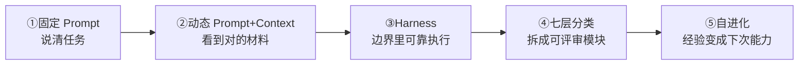
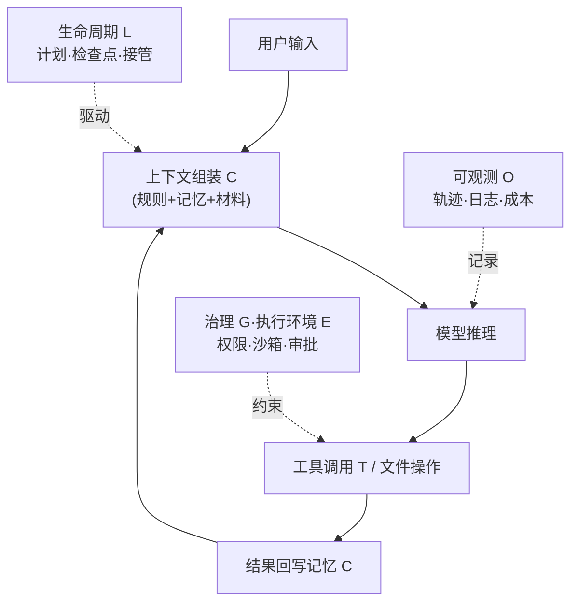

# 《AI 产品经理读懂 Harness》(1/9) · 全景篇——什么是 Harness,为什么它比模型更重要

---

## 本文回答这些问题

1. **什么是 Harness?它是怎么一步步演变出来的?**
2. **为什么需要 Harness?它到底有多重要?**
3. **Harness 一共有哪些模块、组件?**
4. **怎么判断一个产品的 Harness 做得好不好?**
5. **市面上哪些产品的 Harness 做得好?**
6. **Harness 时代,对 AI 产品经理的能力模型提出了什么要求?**

这六个问题,是任何一个团队真正动手做 Agent 时绕不开的认知地基。这篇不堆"Agent 是什么"的教科书定义,只讲你撞上这些问题时该怎么判断。

---

## 开篇:一个反直觉的现象

先说一个我反复看到的现象:

> 两个团队做同类 AI 产品。A 团队用了市面上最强的模型,B 团队用了差一档的模型。结果 B 的产品体验明显更好——更少胡说、更少卡死、更敢放手让它干活。

如果你相信"模型决定一切",这个现象无法解释。但它在真实世界里反复发生。阿里一个团队把同一个应用的 AI Coding 率从 **24.86% 拉到 90.54%**,靠的不是换模型,而是重做了模型外面那一整套东西。腾讯一个团队让 6 个 AI Agent 连写 4 天代码,烧掉 **4 亿 token**,换来的是 5 个血淋淋的教训——问题也几乎都不在模型本身。

这套"模型外面的东西",就是本系列的主角:**Harness(运行框架)**。

本文的核心论断,一句话:

> **Agent = Model + Harness。模型是地板,Harness 才是天花板。**
> 模型决定 Agent 的能力**上限**,Harness 决定 Agent 在真实场景下的**实际表现**。
> 而 PM 真正能影响产品质量的杠杆,不在选模型,在设计 Harness。

---

## 一、什么是 Harness?它怎么一步步演变出来的?(Q1)

### 1.1 一句话拆三层:Prompt 下指令、Context 给材料、Harness 控执行

要理解 Harness,先把它放回一个三层框架里。这三层是产品对外解释 Agent 最好用的"第一眼"语言:

| 层级 | 它负责什么 | 用户能感知到的 |
|---|---|---|
| **Prompt** | 下指令 | Agent 知道自己是谁、怎么说话、怎么做事 |
| **Context** | 给材料 | Agent 能看见项目规则、历史、工具结果、你的偏好 |
| **Harness** | 控执行 | Agent 能安全调用工具、长时间运行、失败能恢复 |

一句话定义:**Harness = 让模型在边界里可靠干活的整套运行环境。** Prompt 把话说清楚、Context 把材料喂对,都还停留在"告诉模型该干什么";Harness 解决的是另一个层级的问题——"它真的能在真实环境里、长时间、安全地把活干完吗?"

### 1.2 五个阶段:AI 应用是怎么一步步走到 Harness 的

Harness 不是凭空冒出来的概念,而是 AI 应用踩着坑一级级长出来的:

- **阶段①固定 Prompt**:解决"怎么把任务说清楚"。天花板:单轮、无状态、说完就忘。
- **阶段②动态 Prompt + Context**:解决"怎么让模型看到对的材料"——文件注入、历史召回、压缩。进了一大步,但还是在"喂数据"。
- **阶段③Harness**:解决"怎么让模型在边界里可靠执行"——权限、工具、记忆、失败恢复。
- **阶段④Harness 七层分类(ETCLOVG)**:解决"怎么把执行环境拆成可评审、可验收的模块"(第三节细讲)。
- **阶段⑤自进化 Harness**:解决"怎么把这次的执行经验变成下一次的能力"(轨迹回流、Skill 沉淀,见 E7)。

中文社区有一句话把这条演进的终点说得最精准:

> **Prompt 只是入口,Context 决定可用度,Harness 决定能不能进生产。**

### 1.3 顺便否决三条"想当然"的捷径(这是判断,不是常识)

很多团队会想抄近路,但下面三条路都被反复证明不够:

- **只堆超长 Prompt**:不解决工具权限、失败恢复、记忆污染、长任务稳定性。
- **只做工具调用**:不解决上下文治理和经验复用。
- **只做训练反馈**:如果没有干净的执行轨迹和明确的奖励,训练回流只会放大错误。

**结论:Harness 不是某一个功能强,而是一整套执行秩序。** 这句话会贯穿后面所有章节。

---

## 二、为什么需要 Harness?它到底有多重要?(Q2)

这一节是全文干货最硬的地方,因为它有两个真实的、带数字的案例。

### 2.1 成功路径:阿里把准确率从 24.86% 做到 90.54%

阿里一个团队没有换更强的模型,而是把模型外面那一整套重做了一遍——AGENTS.md 规则、Spec 驱动开发、工具化环境、测试门禁、多 Agent 评审——把同一个应用的任务准确率从 **24.86% 拉到 90.54%**。

这说明一件事:**当模型固定时,Harness 的成熟度几乎决定了产品最终的可用性。**

### 2.2 踩坑路径:腾讯 4 亿 token 换 5 个教训

腾讯一个团队让 6 个 Agent 连写 4 天代码,烧掉 **4 亿 token**,换来 5 个教训。问题几乎都不在模型本身,而在没有把执行秩序设计好——任务跑飞、上下文污染、无效返工。

> **把这两个数字放一起,才是诚实的 ROI:**
> 只讲 90% 是骗人,只讲 4 亿 token 是吓人。
> 真实的 ROI = 上限收益 × 你的 Harness 成熟度。Harness 不成熟时,投入越大,翻车越惨。

### 2.3 为什么 Demo 好、一上真实项目就翻车

QQ 音乐的 Harness 实践提炼出一个朴素公式:

> **代码产出 = AI 能力 × 上下文质量。**

Demo 翻车,几乎都崩在"上下文质量"这一项:Demo 里上下文小而干净,真实项目里代码库巨大、规则复杂、历史混乱。模型能力没变,但乘上一个糟糕的上下文质量,结果就崩。这正是本系列要花整整一篇(E4)讲上下文与记忆的原因——它是 Demo 到生产那道鸿沟的主战场。

### 2.4 一句话讲清重要性

模型是通用的,业务是具体的。**Harness 就是把通用模型转成解决特定业务的专用系统的那一层。** 没有好架构,再强的模型也发挥不出来;有了好架构,普通模型也能做出好用、可靠的产品。

### 2.5 一个真实的反面例子:让手机 Agent "打开手电筒"

讲个我亲眼见过的例子。某个手机上的 Agent,我让它做一件再简单不过的事——"打开手电筒"。结果它找了几十轮、来回折腾了半天,最后还调用失败了。

问题出在哪?**不在模型,在 Harness 的工具层(T)。** 这个 Agent 注册的工具太多了——好几百个。工具一多,"在几百个工具里选对那一个"的逻辑就成了瓶颈;它没把这件事优化好,于是连"打开手电筒"这种本该一步到位的事,都变成了又慢、又费 token、又容易失败的灾难。

这正好反过来说明了"Harness 做得好"长什么样:

| | Harness 做得差 | Harness 做得好 |
|---|---|---|
| 速度 | 几十轮还没干成 | 一两步到位 |
| 成本 | 白烧大量 token | 省 token |
| 成功率 | 高频失败 | 高成功率 |
| 稳定性 | 时好时坏 | 稳定可预期 |

同一个模型、同一句话,Harness 的工具调度做没做好,产品体验就是天和地的差别。这也是为什么本系列要专门用一章(E3)讲工具系统——工具不是越多越好,**怎么让 Agent 在一堆工具里快速选对那一个,本身就是一门 Harness 功夫。**

---

## 三、Harness 一共有哪些模块、组件?(Q3)

这是 E1 最重要的产出:**给你一张能拆解任何 Agent 产品的模块地图,而且这张地图就是本系列后面每一章的目录。** 第一章先把模块讲清楚,后面每一章单独深讲一个模块——所以这里的拆解必须干净、不重叠、能一一对应。

### 3.1 先用两层语言对齐:Prompt/Context/Harness 与 ETCLOVG

- **对外讲清楚**,用三层:Prompt 下指令、Context 给材料、Harness 控执行。
- **做模块拆解和评审**,用七层(ETCLOVG)——它是把"Harness 控执行"这一层继续展开,出自论文《Agent Harness Engineering: A Survey》:

| 层 | 名称 | 这层管什么 |
|---|---|---|
| **E** | 执行环境(Execution) | Agent 在哪里动手,会不会误伤真实系统 |
| **T** | 工具接口(Tooling) | Agent 怎么调用外部能力 |
| **C** | 上下文(Context) | Agent 每一步应该看什么材料 |
| **L** | 生命周期(Lifecycle) | 长任务怎么开始、暂停、恢复、结束 |
| **O** | 可观测(Observability) | 出错后能不能看懂发生了什么 |
| **V** | 验证评测(Verification) | 怎么判断结果真的可用 |
| **G** | 治理安全(Governance) | 谁能让 Agent 做什么 |

论文还给了一个关键判断:开源项目里,**生命周期 L、验证 V、执行 E 覆盖较密,而可观测 O 和治理 G 普遍偏薄**——这恰恰是大多数 Agent "能 Demo、难生产"的结构性原因。

### 3.2 模块地图:七层模块 → 本系列每一章(逐章对应)

把七层模块和后续章节对齐,就是这个系列的完整骨架。**第一章(本文)讲全景,后面每一章拎出一个模块单独讲透:**

| 本系列章节 | 主讲模块(ETCLOVG) | 这一章回答的核心问题 |
|---|---|---|
| **E2 编排循环** | 贯穿 E/T/L 的"主循环" | Agent 怎么 Think-Act-Observe?怎么不死循环跑飞? |
| **E3 工具系统与 MCP** | **T 工具接口** | 怎么让 Agent 调对工具、调安全? |
| **E4 上下文与记忆** | **C 上下文** | 一次对话带着什么?怎么组装 / 压缩 / 缓存,记忆怎么不失控? |
| **E5 能力的组织** | 能力组织(Skills / 子 Agent / 多 Agent) | 能力多了、任务大了怎么拆、怎么管? |
| **E6 安全与权限** | **E 执行环境 + G 治理安全** | 怎么让 Agent 既放手又不闯祸? |
| **E7 模型与 Harness 共同进化** | 自进化(轨迹 / Skill / 训练回流) | Harness 怎么反哺模型训练? |
| **E8 评估、可观测性与数据驱动** | **V 验证 + O 可观测** | 怎么科学证明 Agent 真的变好了? |
| **E9 给 DeepSeek 的产品提案书** | 综合应用 | 把上面所有模块拼成一份真实产品提案 |

读这张表的方法很简单:你以后拿到任何一款 Agent 产品,就照着 E/T/C/L/O/V/G 七个抽屉逐个拉开看;每个抽屉的细节,本系列都有一整章在等你。

### 3.3 为什么这七块能管住一个 Agent:Harness 是 Agent 的操作系统

这七层不是拍脑袋分的,而是因为 **Harness 本质上是 Agent 的操作系统**。操作系统管进程、内存、IO、权限,决定应用能不能稳定运行;Harness 管的是同一类事,只是对象换成了 Agent——上下文(C)像内存、工具(T)像系统调用、执行环境(E)像进程沙箱、治理(G)像权限系统、可观测(O)像系统日志:

(这是简化主干图,标出了七层各自落在循环的哪个位置;完整版的上下文生命周期 + 缓存分层留到 E4 拆。)

---

## 四、怎么判断一个产品的 Harness 做得好不好?(Q4)

这一节给两样东西:一张**定性的拆解打分表**(逐层看有没有),再加一套**可量化的评测指标**(到底好到什么程度)。光说"做得好"是耍流氓,得能量化。

### 4.1 第一步:七层拆解打分表(逐层看"有没有")

拿到任何一款 Agent,照七层逐项问、逐项看信号,每项可以先做"有/弱/无"三档粗判:

| 维度 | 该问的问题 | 做得好的信号 |
|---|---|---|
| 执行环境 E | 它在哪里安全动手? | 有沙箱 / 隔离 / 可回滚,不直接碰生产环境 |
| 工具接口 T | 调工具有没有边界? | 工具有权限和参数约束、失败有清晰提示 |
| 上下文 C | 每步看什么、怎么省? | 有压缩 / 缓存 / 按需加载,不无脑塞材料 |
| 生命周期 L | 长任务能否暂停恢复、人工接管? | 有计划 / 检查点 / 中途接管 |
| 可观测 O | 出错能不能看懂发生了什么? | 有轨迹 / 日志 / 成本 / 失败原因 |
| 验证评测 V | 怎么确认结果真能用? | 有测试 / 评测集 / 回归 / 验收闸门 |
| 治理安全 G | 谁能让它做什么? | 有权限 / 审批 / 审计 / 防提示注入 |

**定性标准一句话:** 好不好不看哪个功能最炫,而看它把七项里**几项做成了系统级硬约束**,而非提示词软约束。能靠一句提示词绕过的边界,在生产环境里等于没有边界。

### 4.2 第二步:可量化的评测指标(到底"好到什么程度")

定性拆完,真正能写进周报、能跟老板汇报的是**数字**。Agent 评测不能只看一个"成功率",业界(Cursor、阿里、腾讯、AWS 等)的做法是把指标分成 6 层一起看:

| 评测层 | 它回答什么 | 可量化指标(挑关键的) |
|---|---|---|
| **离线任务集** | 新模型 / 新 Harness 能不能过基础关 | 任务成功率、测试通过率、回归失败数、SWE-bench / CursorBench 类分数 |
| **在线真实信号** | 用户真实工作里是否变好 | 建议采纳率、PR 合并率、人工接管率、取消率、重试率 |
| **执行过程** | 它为什么成功 / 失败 | 平均步数、工具调用成功率、上下文命中率(找对文件的比例)、错误恢复次数 |
| **质量反馈** | 它的建议有没有用 | 评论解决率、误报率、漏报率 |
| **经济性** | 能不能规模化跑 | token 成本、缓存命中率、首 token 延迟、单任务耗时 |
| **可靠性** | 能不能长时间稳定跑 | 崩溃率、任务中断率、跨会话恢复率 |

**几个能直接引用的真实数字,证明这些指标不是纸上谈兵:**

- 阿里商旅多 Agent 把任务准确率从 **24.86% 做到 90.54%**——这就是"任务成功率"这条指标的真实跃迁。
- 阿里某导购 Agent 用 LLM-as-Judge 评测,做到 **91.9% 与人工一致**的准确率(前提是结构化 Benchmark + 多评审投票 + 人工抽样三件套);芝麻信用的"评测 Agent"实现 **80%+ 机审率**。说明"用 AI 评 AI"可量化、可上规模,但必须先用人工校准到 90%+ 一致性才能信。
- Claude Code 官方称其整个 Harness 围绕 **prompt caching** 组织——"缓存命中率"和"首 token 延迟"是经济性里最硬的两个产品指标,直接决定能不能长期用。

**量化标准一句话:** 一个 Harness 做得好不好,最终要落到"这 6 层里,你能报得出几个带数字的指标,而且这些数字在持续变好"。报不出数字的 Agent,所谓"变好了"只是错觉。

> 注:可观测(O)和验证(V)这两层,正是大多数产品最薄、也最能拉开差距的地方,本系列会在 E8 用一整章专门讲怎么把这套评测仪表盘搭起来。

---

## 五、市面上哪些产品的 Harness 做得好?(Q5)

下面这些只做**一句话定位速览**,深度对比留给后续各章。每款一句**原创定位**,不做概念综述。

| 产品 | 一句话哲学 | 它最强的维度 | 档案 |
|---|---|---|---|
| **Claude Code** | "笨循环"——把秩序放进 Harness,而不是堆在模型里 | 执行环境 E / 生命周期 L 的工程闭环 | `entities/claude-code.md` |
| **Codex** | OpenAI 的极简主义运行框架,模型+工具+状态的循环 | 执行 E / 生命周期 L(可视化会话、随时插队) | `entities/codex.md` |
| **Cursor** | 从编辑器一路进化到 Agent Mode | 上下文 C(只读相关上下文)/ 交互 | `entities/cursor.md` |
| **Trae** | SOLO 多 Agent 覆盖从需求到部署的全流程 | 能力组织 + 生命周期 L | (本章一句话带过) |
| **GitHub Copilot** | 不另起炉灶,把 Agent 接进 GitHub 已有的秩序 | 治理安全 G(防火墙 / 审计 / 防注入) | `entities/github-copilot.md` |
| **OpenCode** | 开源阵营:客户端-服务端分离 + 可治理的开放 Harness | 治理 G + 架构开放 | `entities/opencode.md` |
| **Claude Cowork** | 把 Claude Code 的执行力搬到知识工作 | 生命周期 L(计划-确认-执行、定时任务) | `entities/claude-cowork.md` |
| **Hermes Agent** | 自进化:把轨迹 / Skill / RL 训练纳入闭环 | 自进化(见 E7) | `entities/hermes-agent.md` |
| **Qoder / CodeBuddy** | 国产 Harness Engineering:专家团 + 终端沙箱 | 执行 E + 能力组织 | `entities/qoder.md`、`entities/codebuddy.md` |
| **Manus** | 上下文工程做得好的通用任务 Agent | 上下文 C | (本章先不展开) |

### 5.1 我高强度用下来,四款各一句真实体感

光看定位没用,下面这几款是我自己长期用过的,各讲一句真实感受——也顺手标出它各自在 ETCLOVG 哪一层立住了:

- **Claude Code**:最大的感受不是它代码写得多好,而是它**定义了一整套行业标准**——`CLAUDE.md`(项目规则注入)、MCP(工具协议)、Skills(能力封装)现在几乎成了别家都在抄的事实标准;而且**长任务、复杂任务**它明显更稳。换句话说,它强在把执行秩序(C/T + 能力组织)做成了行业范式。
- **Cursor**:两点最戳我。一是 **Plan 模式和 Ask 模式有独立入口**——先想清楚再动手这件事被做成了产品形态,而不是靠你自觉;二是**省 token**,它只筛选、读取和当前任务相关的上下文,不无脑全塞。这正是上下文层(C)做得好的样子。
- **Codex**:它赢在**可控性和可回溯**。能按项目新建对话、有可视化的会话管理,历史好回溯;**思考流和执行流穿插展示**,你看得见它在想什么、在做什么;最关键是**支持随时插队**——这是生命周期层(L)和可观测层(O)做得到位的表现。
- **Trae**:它的 **SOLO 模式用多 Agent 覆盖了从需求分析、任务拆解、编码、测试到部署的完整闭环**,AI 主导执行、开发者只管验收;而且**规则和记忆能分全局级和项目级设置**,还能把指定文档塞进上下文。这是"能力组织 + 上下文"两层一起发力。

> 一句话总结这四款:它们各自在不同的层把"软约束"变成了"产品形态"——Claude Code 做成了行业标准、Cursor 做成了上下文筛选、Codex 做成了可控可回溯、Trae 做成了全流程闭环。**这正是 Harness 做得好的共同特征:把"你得自觉这么做"变成"产品本来就这么运转"。**

### 5.2 再用第四节的尺子,点评三款海外样本

我没深度用过下面这三款,但用 ETCLOVG 这把尺子拆它们的公开机制,同样能看出门道:

- **GitHub Copilot 强在 G(治理安全)**:它把 Agent 的 commit 做成签名可验证、把发起人标为 co-author、对 Issue 里的隐藏字符做提示注入过滤、用防火墙 allowlist 管出网、自动化任务默认忽略无写权限用户的事件。它的路线本质是"借 GitHub 平台的现成秩序",这是独立 Agent 学不来的。
- **OpenCode 强在架构开放 + 治理**:它把 Harness 做成"客户端 + 服务端",服务端暴露标准接口可被远程 / 程序化驱动;权限分 allow / ask / deny 还能按命令和路径精细配置;甚至能用 policies 管"允许用哪个模型厂商"。开源也能把治理做细,这是它的说服力。
- **Claude Cowork 证明 Harness 可迁移**:它把 Claude Code 那套"先给计划→你批准→才动手 + 定时任务 + Skills 复用"原样搬到知识工作场景,照样成立。这恰好反证了——**真正的护城河是 Harness 这套执行秩序,不是某个垂直功能。**

---

## 六、Harness 时代,对 AI 产品经理的能力模型提出了什么要求?(Q6)

前面五节铺垫的所有东西,最后会逼出一个问题:**做 Agent 产品的 PM,和做传统软件的 PM,到底差在哪?**

我的判断是:差异最终收敛到两个最本质的能力——**架构设计能力**和**评估能力**。传统 PM 设计的是"功能",Harness 时代的 AIPM 设计的是"一个能自主完成任务的智能系统"。

### 6.1 第一核心:架构设计能力(骨架能力)

它把通用模型变成解决具体业务的专用系统,包含:

- **角色与边界架构**:定义每个 Agent 的身份、能力范围、禁止行为、协作关系。
- **流程编排架构**:设计从输入到输出的完整链路,包括正常流程、异常流程和人机回环。
- **安全护栏架构**:把"软约束"转化为系统级"硬约束"。
- **记忆与工具架构**:设计记忆管理策略和工具调用规则,让 Agent 能"记住"和"做事"。
- **多 Agent 协作架构**:多个 Agent 协同时,设计它们的通信、调度、决策机制。

> 为什么它排第一:Harness 的本质就是系统架构。没有好架构,再强的模型也发挥不出来;有了好架构,普通模型也能做出好产品。

### 6.2 第二核心:评估能力(眼睛能力)

Agent 是概率性的,没有量化评估,就没有科学决策。它包含:

- **多维评估体系**:任务完成率 + 可控率 + 安全合规率 + 成本,四维一起看。
- **可观测性设计**:让业务指标、系统指标、安全指标都看得见。
- **错误归因**:定位问题根因——是架构问题?Prompt 问题?工具问题?还是模型问题?
- **持续迭代**:基于归因结果不断优化架构,形成闭环。

> 为什么它排第二:Agent 永远不会完美,它的进化是没有终点的过程。评估能力就是 AIPM 的眼睛——没有它,你只能凭感觉优化,永远不知道做的是对是错。

### 6.3 两者是一个闭环

架构设计回答"做什么",评估能力回答"做得好不好",两者合起来就是"怎么做得更好"。

### 6.4 为什么这两项不可替代

- **工程师**能实现架构,但不设计架构——他只关心技术可行性,不关心业务目标和用户需求。
- **数据科学家**能分析数据,但不定义评估体系——他只关心数据本身,不关心什么是"业务上的好"。
- **模型研究员**能优化模型,但不把模型变成产品——他只关心模型的技术指标,不关心产品的可用与可靠。

只有 AIPM 站在业务、用户、技术的交叉点上,同时具备这两个能力,才能把大模型转化为真正有价值的商业产品。

### 6.5 与工程师对话的检查清单(拿着就能用)

- [ ] 我们 Agent 的"操作系统",是现成的还是自建的?这个选择论证过吗?
- [ ] ETCLOVG 七层里,我们当前**最弱**的是哪一项?
- [ ] 给老板的 ROI,**同时**算了成功上限和踩坑成本吗?
- [ ] 我们的架构,有没有把关键约束做成**硬约束**?评估有没有**量化指标**?

### 下期预告

E2《编排循环:任务怎么"跑起来"又不跑飞》——从"Agent 卡住的几种常见死法"讲起,看腾讯那 4 亿 token 是怎么烧掉的,以及几道硬闸该怎么设计。

---
