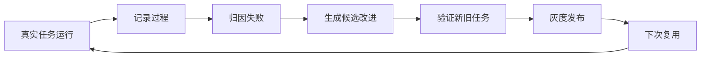

# 《AI 产品经理读懂 Harness》（7/9） · 自进化篇——Agent 为什么用了一万次，还是没有变聪明？

## 本文回答 9 个问题

1. 什么是 Harness 自进化？
2. Harness 自进化的工作逻辑是什么？
3. 它靠什么“自己改自己”？是模型自己写代码吗？
4. 它会不会无限改下去？什么时候停？
5. 它和最近很火的 Loop Engineer 有什么区别？
6. 如果要做一个自进化 Agent Harness，应该怎么落地？
7. 现在有没有现成框架或工具可以参考？
8. 做 Harness 自进化有哪些坑？怎么防止退化？
9. Harness 自进化以后，人还有什么价值？

---

## 开场：为什么 Agent 用了一万次，还是没有变聪明？

很多人对 Agent 有一个默认期待：用得越多，它应该越懂我，越会做事，越少犯错。

但真实体验经常不是这样。

今天让它处理一份复杂表格，它绕了五次才成功。明天给它一份类似表格，它还是从头试错。今天让它排查一个问题，你手把手纠正了工具用法；下次遇到同类问题，它又忘了这条路。用户以为“它应该学会了”，但系统其实只是“这次做完了”。

问题不一定出在模型不够聪明，而是产品没有设计“长记性”的机制。

大多数 Agent 只保存了最后答案，没有保存过程里的关键东西：哪一步失败了，为什么失败，用户在哪里接管，什么修复方式有效，改完以后有没有复测。没有这些，下一次只能重新撞墙。

所以，第七章真正要讲的不是“AI 会不会自己进化”这种大词，而是一个更产品化的问题：

> **一个 Agent 到底是真的越用越聪明，还是只是在包装一个会自动循环的工具？**

更准确地说，真正需要自进化的不是单个 Agent，而是 Agent 背后的 Harness。

因为用户体验到的不是一个孤立模型，而是“模型 + 工具 + 上下文 + 记忆 + 技能 + 权限 + 评估 + 发布流程”组成的一整套系统。模型再强，如果这套系统不能吸收失败、沉淀经验、验证改进，Agent 就不会真正变强。

---

## 一、什么是 Harness 自进化：不是 AI 自己长脑子，而是系统开始长记性

先给一个大白话定义：

> **Harness 自进化，就是让 Agent 在真实任务中产生的失败、成功路径、用户接管和验证结果，被系统沉淀成下一次能复用的规则、技能、评测题和训练素材。**

这里有几个关键词。

第一，来源是真实任务。不是闭门写一堆提示词，而是从用户真实使用中发现问题。

第二，沉淀的是可复用资产。不是把聊天记录存起来就算完，而是要变成下次能触发、能遵守、能验证的东西。

第三，必须能验证。不能靠一句“感觉更好了”，要能证明同类错误减少了，旧能力没有被改坏。

可以把它理解成一个产品团队的成长方式。

一个新人第一次办复杂流程，靠试错完成。第二次如果还是从头试错，说明团队没有沉淀。真正成熟的团队，会把第一次踩过的坑写进办事手册，把关键节点变成检查清单，把常见错误变成培训题。下一个人再做，就不会从零开始。

Agent Harness 也是一样。

普通 Agent 做完任务就结束。自进化 Harness 会多做一步：复盘这次任务，把有价值的经验变成系统能力。

### 1.1 三种“看起来像自进化，但其实不是”

| 看起来像自进化 | 为什么不够 | 真正应该做到什么 |
|---|---|---|
| 保存聊天记录 | 只是知道发生过，不代表下次会用 | 提炼成可触发的规则、技能或评测题 |
| 让模型写一句“下次注意” | 太虚，没有边界，也不能验证 | 绑定具体失败原因和适用场景 |
| 评测分涨了 | 可能只是刷题，不代表真实变好 | 旧任务不退化，新任务也变好 |
| 自动生成一堆技能 | 技能太多会互相打架 | 有触发、验证、合并、废弃机制 |
| Agent 自己改配置 | 风险太大，可能改坏安全边界 | Agent 只能提建议，高风险改动要审核 |

所以，自进化不是“AI 自己想怎么改就怎么改”。

更准确地说，它是一套受控的产品机制：记录问题，分析原因，提出改进，验证效果，小范围发布，必要时回滚。

### 1.2 自进化到底在进化什么？

它不一定是在改模型本身。

更多时候，先改的是外部 Harness：

| 进化对象 | 大白话解释 | 例子 |
|---|---|---|
| 记忆 | 记住用户和任务背景 | 用户偏好、项目约束、历史决策 |
| 技能 | 记住一类任务怎么做 | 办签证、查问题、写周报的步骤 |
| 工具说明 | 让 Agent 更会用工具 | 什么时候查文档，什么时候不要猜 |
| 流程 | 让任务顺序更稳定 | 先确认目标，再操作，再检查结果 |
| 权限规则 | 防止越权和误操作 | 高风险动作必须确认 |
| 评测题 | 把失败变成下次上线前必考题 | 这次踩过的坑，以后每次都测 |
| 训练素材 | 长期反哺模型 | 高质量过程、纠错轨迹、人工接管样本 |

这也是为什么要叫 Harness 自进化，而不是简单说“模型自进化”。

短期看，是 Harness 在变好。长期看，Harness 产生的高质量数据可以再反哺模型。

---

## 二、它怎么“自己改自己”：记录、归因、候选改进、验证、发布、复用

很多人听到“自己改自己”，会马上担心：是不是模型自己写代码？会不会无限循环？会不会把系统改坏？

这些担心是对的。因为如果没有边界，自进化就会变成自动制造风险。

比较靠谱的 Harness 自进化，不是让 Agent 随便改自己，而是一个六步闭环。



### 2.1 第一步：记录过程

自进化的第一步不是改，而是看见。

要记录的不是最后答案，而是完整过程：

- 用户要完成什么任务。
- Agent 每一步做了什么。
- 调用了哪些工具。
- 哪一步失败。
- 用户在哪里接管。
- 最后有没有完成。
- 花了多少时间、多少成本、多少次重试。

没有过程记录，就没有自进化。只有“这次失败了”的结论，却不知道为什么失败，后面所有优化都会变成猜。

Meta-Harness 的关键启发就在这里。它不是只看一个分数，而是让改进者能看到过去候选方案的源文件、分数和执行过程。项目页里展示的小规模实验，从 28.5% 提到 46.5%。论文里还提到，在最重的场景里，每一步可以利用约千万级诊断材料；在 TerminalBench-2 运行中，改进者每轮中位读取 82 个文件。

这说明一件事：自进化的燃料不是一句总结，而是可追溯的过程证据。

### 2.2 第二步：归因失败

很多团队一看到 Agent 失败，就会说“模型不行”。这通常太粗。

同样是失败，原因可能完全不同：

| 失败类型 | 表现 | 应该改哪里 |
|---|---|---|
| 信息不够 | 没读到关键文档 | 改上下文 |
| 工具选错 | 该查资料却开始编 | 改工具说明 |
| 步骤混乱 | 没有先后顺序 | 改流程 |
| 技能没触发 | 明明有经验但没用 | 改技能触发 |
| 规则缺失 | 做了不该做的事 | 改权限规则 |
| 模型不会 | 材料齐了也做不对 | 进入训练或换模型评估 |

这一步很重要。因为只有归因正确，经验才能沉淀到正确位置。

用户偏好应该进记忆。重复任务路径应该进技能。安全边界应该进权限规则。失败案例应该进评测题。高质量纠错过程，才考虑进入训练候选池。

如果所有问题都塞进一段超长提示词，系统很快会变脏：内容越来越长，规则互相冲突，成本越来越高，效果反而越来越不稳定。

### 2.3 第三步：生成候选改进

归因之后，系统可以生成候选改进。

这里的“生成”不一定是写代码。候选改进可能是：

- 新增一条规则。
- 更新一个技能。
- 改一段工具说明。
- 增加一道评测题。
- 调整任务流程。
- 在必要时修改系统行为。

Self-Harness 的思路很适合解释这一点。它不是让模型直接乱改，而是先从失败过程中找共性失败模式，再提出小范围改动，最后跑验证。

可以理解成：

```text
失败过程聚类
→ 找共性失败机制
→ 提出多个小改动
→ 跑回归验证
→ 只接受不退化的改动
→ 合并到下一版 Harness
```

这里有一个关键原则：小改动优先。

候选改进必须绑定具体失败原因，能说清楚预期改善什么，并且能被验证。不能因为一个失败，就大改整套系统。

### 2.4 第四步：验证

没有验证的自进化，就是自动制造风险。

至少要过三道门：

1. 旧任务不变差。以前能完成的，不能被改坏。
2. 目标问题变好。这次要修的问题，必须真的改善。
3. 新任务不过拟合。不能只会刷这几道题。

这也是为什么自进化和评估天然绑在一起。第八章会专门讲评估，但第七章先把原则说清楚：每一次 Harness 改动，都应该被当成一次小发布。

### 2.5 第五步：发布和回滚

通过验证，也不代表马上全量上线。

比较稳的发布链路是：

```text
候选改进
→ 自动验证
→ 高风险人工审核
→ 小范围灰度
→ 观察线上表现
→ 正式进入能力库
→ 支持一键回滚
```

尤其是安全、权限、数据使用相关改动，不能让 Agent 自己直接改。

一句话：Agent 可以建议改进，但不能绕过人和流程直接改正式能力。

### 2.6 它会不会无限改下去？

不会，也不应该。

好的自进化系统必须有停止条件：

- 没有新的共性失败模式了。
- 新改动无法带来明显提升。
- 改动开始让旧任务变差。
- 成本变高但效果没变好。
- 触发高风险规则，需要人工审核。
- 到达本轮预算、时间或次数上限。

所以，自进化不是永动机。它更像一个受控的改进流程：有输入，有目标，有验证，有退出。

---

## 三、它和 Loop Engineer 有什么区别：一次任务内循环 vs 跨任务长期进化

最近 Loop Engineer 很火。很多人会把它和 Harness 自进化混在一起。

我的理解是：两者有关，但不是一回事。

> **Loop Engineer 解决的是“这一次任务怎么循环做完”；Harness 自进化解决的是“这一次任务的经验，怎么沉淀给下一次”。**

可以这样区分：

| 对比项 | Loop Engineer | Harness 自进化 |
|---|---|---|
| 关注范围 | 单次任务内 | 多次任务之间 |
| 核心动作 | 计划、执行、检查、修正 | 记录、归因、沉淀、验证、复用 |
| 目标 | 把这次任务做完 | 让以后类似任务少犯错 |
| 产物 | 本次任务结果 | 规则、技能、评测题、训练素材 |
| 主要风险 | 循环太久、成本太高、停不下来 | 越改越脏、规则冲突、旧能力退化 |
| 人的角色 | 设计任务循环和检查点 | 设计进化边界、验收标准和治理机制 |

Claude Code 这类产品里的 Agent Loop，很适合解释“自迭代”。它会在一次任务里不断计划、执行、检查、修复。比如写代码时，先改，再跑检查，失败再修。

但这还不等于自进化。

自迭代是这次任务里边做边改。自进化是把这次任务里的经验留给未来。自演化则是更长期地看，整套系统能力结构会随着环境变化而变化。

三者关系可以这样理解：

```text
Loop Engineer 把这次任务跑起来
→ Harness 自进化把这次经验留下来
→ 下一次 Loop 跑得更稳
```

所以，本章不是反对 Loop Engineer，而是把它放到更大的系统里看。

如果只有 Loop，没有沉淀，Agent 每次都会重新学习。如果只有沉淀，没有好的 Loop，单次任务又跑不起来。真正成熟的 Agent 产品，需要两者配合。

---

## 四、如何实现一个 Agent Harness 自进化：从过程记录到能力库的 6 步

如果真的要做一个自进化 Agent Harness，我建议不要一上来就追求“自动改代码”。

更稳的路径是先做 6 步。

### 4.1 第一步：让系统看得见

先把任务过程记录下来。

最小要记录：

- 任务目标。
- 关键上下文。
- 每一步动作。
- 工具调用结果。
- 失败原因。
- 用户接管点。
- 最终结果。
- 成本和耗时。

这一步决定了后面能不能复盘。

很多产品只记录最终对话，看起来省事，但对自进化几乎没用。因为你看不到 Agent 到底是怎么错的。

### 4.2 第二步：建立失败分类

不要把所有失败都叫“回答不好”。

建议先用一张简单分类表：

| 类别 | 判断问题 | 典型处理 |
|---|---|---|
| 上下文问题 | 它是不是没看到关键材料？ | 改上下文组织和召回 |
| 工具问题 | 它是不是用错工具或不会用工具？ | 改工具说明和调用策略 |
| 流程问题 | 它是不是步骤乱了？ | 改任务流程 |
| 技能问题 | 它是不是该用经验但没用？ | 改技能触发和技能内容 |
| 权限问题 | 它是不是做了不该做的动作？ | 改权限和确认机制 |
| 能力问题 | 它是不是材料齐了也做不对？ | 进入模型评估或训练候选 |

这张表的价值是帮团队少甩锅。

很多问题不是模型不行，而是 Harness 没把该给的信息、工具、流程和边界组织好。

### 4.3 第三步：把经验放到正确层

这是自进化最容易做错的地方。

不是所有经验都应该写进记忆。也不是所有失败都应该改模型。

| 发现的问题 | 不好的做法 | 正确沉淀方式 |
|---|---|---|
| 用户偏好 | 写进一大段提示 | 写进记忆 |
| 重复任务路径 | 每次重新解释 | 写成技能 |
| 工具使用错误 | 让模型自己猜 | 改工具说明 |
| 安全边界 | 靠模型自觉 | 写进权限规则 |
| 失败案例 | 复盘完就算了 | 变成评测题 |
| 高质量纠错过程 | 只留聊天记录 | 进入训练候选池 |

这里可以把前几章串起来看。

第4章讲上下文和记忆，第5章讲技能和多 Agent，第6章讲安全和权限，第8章讲评估。第七章的自进化，本质上就是把真实运行中的经验，分配到这些层里。

### 4.4 第四步：让 Skill 从执行中生长

Skill 自进化是最适合先落地的一条路。

因为它不一定要改底层系统，也不一定要训练模型。它做的是把重复任务的经验，变成下次可调用的办事手册。

比如某个 Agent 第一次处理报销材料时，发现必须先检查发票字段，再核对金额，再生成表格，最后让用户确认。这个路径如果只停留在一次对话里，下次还会重来。自进化应该把它沉淀成 Skill。

一个 Skill 从执行中生长，大概是：

```text
复杂任务完成
→ 回看过程
→ 提炼成功步骤和踩坑
→ 写成 Skill
→ 标明触发条件和边界
→ 下次自动调用
→ 新坑继续更新
```

这里要特别区分 Memory 和 Skill。

Memory 解决“记得什么”。比如用户不吃香菜，项目叫某个名字，老板偏好什么表达。

Skill 解决“会怎么做”。比如办签证材料该按什么顺序准备，排查某类问题先看哪些线索，写某类报告应该先收集什么证据。

如果把 Skill 也当成普通记忆，系统就会变成一堆散乱笔记。下次任务里不一定找得到，也不一定用得上。

### 4.5 第五步：生成候选改进，但不要直接上线

候选改进可以来自人，也可以来自 Agent。

但不管谁生成，都要满足五个条件：

- 绑定具体失败原因。
- 改动尽量小。
- 能说清楚预期改善什么。
- 能被验证。
- 能回滚。

这一步可以参考 Self-Harness 的思路。它先挖反复出现的失败模式，再提出候选改动，再用回归验证保驾护航。

这比“看到一个问题就改一大段提示词”稳得多。

### 4.6 第六步：进入能力库，并持续清理

通过验证的改进，才进入正式能力库。

能力库可以包括：

- 记忆。
- 技能。
- 工具说明。
- 权限规则。
- 评测题。
- 训练候选数据。

但进入能力库不是终点。

还要定期清理：合并重复技能，废弃过期规则，修正误触发，检查成本变化。否则所谓自进化会变成“自污染”。

---

## 五、现在有哪些框架或工具可以参考？

目前还没有一个“拿来就能解决所有 Harness 自进化”的成熟工具。

更准确地说，现在有三类东西值得参考。

### 5.1 研究原型：Meta-Harness、Self-Harness

Meta-Harness 的价值，是证明“改 Harness”本身可以变成一个外层任务。

它让一个改进者查看过去的候选方案、执行过程和分数，然后提出下一版 Harness。它的重点不是某个具体技巧，而是把“改进系统”也系统化。

Self-Harness 更进一步，强调用同一个模型基于自己的失败过程来提出小改动。它的流程很适合产品经理拿来做评审：

```text
弱点挖掘
→ 候选修改
→ 回归验证
```

这类研究原型的价值是开方向，不是说明明天就能完整产品化。

### 5.2 技能自进化机制：SkillOpt、Cloud Agent Skill、Hermes

这类更贴近产品落地。

它们都围绕一个问题：任务做完以后，怎么把过程里的成功路径和踩坑经验，变成下次可用的 Skill。

Hermes 相关材料里有一个很重要的启发：自进化可以分成外部和内部两条线。

外部是 Skill、规则、流程在变好。内部是把高质量过程、成功轨迹、失败纠偏变成训练素材，长期改善模型。

对大多数团队来说，建议先做外部 Harness 的自进化，再考虑模型训练。

### 5.3 工程化借鉴：Claude Code Agent Loop、AHE 可观测路线

Claude Code Agent Loop 适合借鉴单次任务里的计划、执行、检查、修正。

AHE 可观测路线适合借鉴“看得见才改得动”的思路。也就是说，要先把过程、失败、成本、接管点记录清楚，再谈自动改进。

这几类东西组合起来，才更接近一个真实产品里的 Harness 自进化方案。

---

## 六、做 Harness 自进化最容易踩的 6 个坑

自进化听起来很美，但它最危险的地方也在这里：一旦做错，系统会越改越乱。

### 坑 1：只存结果，不存过程

只存最终答案，后面无法复盘。

看起来数据很多，实际上没有解释力。你知道用户不满意，但不知道 Agent 在哪一步错了。

建议：至少记录任务目标、关键步骤、工具结果、失败点、用户接管点和最终结果。

### 坑 2：经验写了，但下次不会用

很多系统会生成一堆 Skill 或规则，但下次任务里根本不触发。

这就是“写经验”和“用经验”的区别。

相关研究把两者拆开看：一个模型能不能写出有用更新，和它真正做任务时能不能调用并遵守这些更新，不是同一件事。很多系统的问题不是没有经验，而是不会加载或不会遵守经验。

建议：不仅要评测“经验写得好不好”，还要评测“该用的时候有没有用”。

### 坑 3：越进化越脏

Skill 越来越多，规则越来越长，提示越来越复杂，工具说明互相冲突。

一开始好像在进步，过一段时间会发现成本升高、误触发变多、旧任务变差。

建议：自进化必须包含清理机制。合并重复经验，废弃过期规则，给能力库做版本管理。

### 坑 4：为了评测分刷题

如果目标只剩“评测分更高”，系统可能学会针对固定题目优化，而不是真实变强。

建议：训练样本、验证样本、线上样本要隔离。评测题也要定期更新。

### 坑 5：让 Agent 直接改安全规则

这是红线。

为了完成任务，Agent 可能会倾向于把限制改松。如果它能直接改权限规则，风险非常大。

建议：安全、权限、数据使用、外部发布相关改动，必须人工审核。

### 坑 6：把模型训练说得太轻松

“用真实任务数据训练下一代模型”听起来很诱人，但这里有隐私、授权、合规、数据隔离、样本质量一堆问题。

建议：先把 Harness 层的记录、复盘、验证跑通。只有高质量、已授权、已脱敏、已标注的数据，才进入训练候选池。

---

## 七、怎么防止退化，怎么判断真的变好了？

自进化不是改得越多越好。

好的自进化，应该满足三个条件：

1. 同类错误越来越少。
2. 旧能力没有被改坏。
3. 成本和风险可控。

### 7.1 防退化的五道门

```text
版本记录
→ 回归验证
→ 新旧任务对比
→ 灰度观察
→ 一键回滚
```

版本记录，是为了知道改了什么。

回归验证，是为了确认以前会的没有忘。

新旧任务对比，是为了防止只修一个坑，带来三个新坑。

灰度观察，是为了不要一下推给所有用户。

一键回滚，是为了改坏了能立刻退回。

### 7.2 评价 Harness 自进化的 6 类指标

| 评价维度 | 看什么 |
|---|---|
| 成功率 | 类似任务完成率有没有提高 |
| 复犯率 | 同类错误有没有减少 |
| 触发率 | 该用的技能有没有被用上 |
| 遵守率 | 用了技能后有没有按关键步骤做 |
| 成本 | 时间、调用次数、费用有没有失控 |
| 安全 | 有没有越权、误删、泄露、绕过规则 |

这里最容易漏的是“触发率”和“遵守率”。

很多团队只看整体成功率，却不知道 Skill 到底有没有被正确使用。结果是：能力库越来越大，但真实任务里还是不调用。

### 7.3 什么时候应该停下来清债？

出现这些信号，就说明 Harness 可能在腐化：

- 同类错误反复出现。
- 规则冲突变多。
- Skill 误触发增加。
- 提示越来越长。
- 成本越来越高。
- 回归集通过，但线上失败。
- 用户接管率上升。

这时不应该继续堆新规则，而是要做清理：删掉过期规则，合并重复 Skill，重做触发条件，重新整理评测集。

---

## 八、Harness 自进化之后，人还有什么价值？

自进化不会让人消失。

它改变的是人的位置。

过去，人经常亲自下场修每一个问题：改提示词，补规则，手动整理经验，盯每一次执行。

未来，人更像进化系统的设计者和守门人。

| 过去的人 | 未来的人 |
|---|---|
| 手动写提示词 | 设计经验沉淀机制 |
| 一个个修问题 | 定义失败分类和修复优先级 |
| 盯每次执行 | 设计观察指标和接管点 |
| 手动整理经验 | 审核系统生成的技能和规则 |
| 靠感觉判断变好 | 用评测和真实数据判断 |
| 直接控制 Agent | 设计 Agent 能动的边界 |

对 Agent Harness 的产品负责人来说，人的价值会变成四件事。

第一，定义什么值得被沉淀。

不是所有经验都要进系统。有些只是一次性噪声，有些才是高频失败模式。

第二，决定沉淀到哪一层。

是记忆、技能、工具说明、权限规则、评测题，还是训练数据？放错层，系统就会越来越乱。

第三，设计验证标准。

什么叫真的变好？是成功率提升，还是复犯率下降？是成本更低，还是用户接管更少？这些需要人定义。

第四，守住安全和产品边界。

Agent 可以建议改进，但正式能力怎么变、哪些能上线、哪些必须回滚，仍然需要人和流程来决定。

一句话：

> 自进化时代，人的价值不是比 Agent 更会执行，而是比 Agent 更会定义边界、判断价值、设计反馈回路。

---

## 本章小结

Harness 自进化不是一个玄学概念，也不是让 Agent 自己随便改自己。

它是一套产品机制：真实任务运行后，系统记录过程，归因失败，生成候选改进，通过验证后沉淀到记忆、技能、规则、工具说明、评测题或训练素材里。下一次类似任务出现时，Agent 不再从零开始。

它和 Loop Engineer 的区别在于：Loop Engineer 解决这一次任务怎么做完，Harness 自进化解决这一次经验怎么留给下一次。

它的难点也很清楚：经验可能写了但不会用，系统可能越改越脏，评测可能被刷，安全规则可能被绕开。所以自进化必须有版本、验证、灰度、回滚和人工审核。

真正做得好的 Harness 自进化，不是改得越来越多，而是同类错误越来越少，旧能力不退化，成本和风险可控。

---

## 与工程师对话的检查清单

如果要评审一个“自进化 Agent Harness”方案，可以直接问这 12 个问题：

- [ ] 我们记录的是最终答案，还是完整任务过程？
- [ ] 我们能知道失败发生在哪一步吗？
- [ ] 我们能区分是模型问题、工具问题、上下文问题、规则问题，还是技能问题吗？
- [ ] 这次经验应该沉淀到哪一层：记忆、技能、工具说明、权限规则、评测题，还是训练数据？
- [ ] 下次类似任务出现时，这条经验能自动触发吗？
- [ ] 我们有没有评测“该用的时候有没有用”？
- [ ] 改动上线前，旧任务有没有跑回归？
- [ ] 新任务有没有验证，防止只会刷旧题？
- [ ] 高风险改动有没有人工审核？
- [ ] 改坏了能不能一键回滚？
- [ ] 经验库有没有合并、废弃、清理机制？
- [ ] 如果数据要进入训练，是否有授权、脱敏和训练评测隔离？

---

## 对 DeepSeek 意味着什么

如果 DeepSeek 要做桌面端 Agent，早期不一定要急着做“模型自己训练自己”。更现实的路线，是先把 Harness 自进化闭环搭起来：记录真实任务，沉淀高频失败，生成技能和评测题，稳定提升同类任务表现。等这套数据资产足够干净、可控、可验证，再反哺模型和下一代 Harness。

---

## 下期预告

第8章讲评估。

本章一直在说“验证通过”“防止退化”“证明真的变好”。但怎么证明？Agent 的任务往往是多步骤、开放式、结果不唯一。下一章就专门讲：怎么科学评价一个 Agent，到底是变强了，还是只是看起来更会说。
