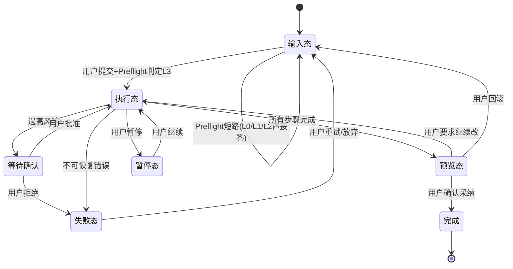

# 小蓝鲸桌面端 · UI 线框示意

> 状态：开工前必读契约（2026-06-30）
> 性质：线框级示意图，定布局/状态/交互流。AI 搭前端组件照此，不自行编布局比例和页面流转。
> 核查范围说明：依据小蓝鲸文档第 12 章（UI 信息架构）、06 验收规格（三态/双工作台/审批）、04 数据契约（状态机/事件）。
> 形式：Mermaid + 文字线框（可进 git diff，AI 可读）。视觉细节等做出来再调。

---

## 一、整体布局（对应小蓝鲸 12.2）

```
┌─────────────────────────────────────────────────────────────┐
│ 顶部栏：[Code] [Work] (后续可扩 Design/Data)      ⚙设置 📋  │
├──────────┬───────────────────────────────┬──────────────────┤
│ 左侧栏   │ 中间主区域                     │ 右侧详情面板     │
│          │                                │                  │
│ ➕新建   │  (三态切换：见第二章)           │ (任务进行时显示) │
│ 📋任务   │                                │                  │
│ 📁项目   │                                │ 🎯目标契约       │
│ 🔧Skills │                                │ 📐任务计划       │
│ 🔌MCP    │                                │ 📜工具日志       │
│ ⏰自动化 │                                │ 🔒权限记录       │
│ 📜历史   │                                │ ✅校验结果       │
│ ⚙设置   │                                │ 🧠记忆引用       │
├──────────┴───────────────────────────────┴──────────────────┤
│ 底部输入区：[继续][暂停][⏮回滚][🔄重新规划][➕追加][💡解释] │
└─────────────────────────────────────────────────────────────┘
```

**比例建议**：左 200px / 右 280px 固定，中间自适应。右侧任务未进行时可折叠。

---

## 二、三个核心状态（对应小蓝鲸 12.2 三态）

### 状态 A：首页输入态

```
┌─ 中间主区域 ──────────────────────────────┐
│                                            │
│           小蓝鲸                            │
│      你的桌面生产力 Agent                  │
│                                            │
│   ┌──────────────────────────────────┐    │
│   │ 描述你要做的事...                │    │
│   │                                  │    │
│   └──────────────────────────────────┘    │
│              [开始任务]                    │
│                                            │
│   💡 试试：修复登录接口的500错误            │
│   💡 把这3个网页整理成报告                  │
│   💡 整理我的下载文件夹                     │
│                                            │
└────────────────────────────────────────────┘
```
右侧面板隐藏。底部只有输入框。

### 状态 B：任务执行态

```
┌─ 中间主区域 ──────────────┬─ 右侧详情 ──────┐
│ ▶ 正在执行：修复登录500    │ 🎯 目标契约     │
│                           │  定位并修复bug  │
│ ● 步骤1：读取项目结构 ✅   │  不改测试文件   │
│ ● 步骤2：搜索login调用 ⏳ │ 📐 计划         │
│ ○ 步骤3：定位根因         │  1.读结构       │
│ ○ 步骤4：修改代码         │  2.搜调用       │
│ ○ 步骤5：跑测试           │  3.改代码       │
│ ○ 步骤6：生成Diff         │  ...            │
│                           │ 📜 工具日志      │
│ 💭 思考：login函数在       │  read_file ✅   │
│    auth.ts:42，返回了...  │  shell:grep ⏳  │
│                           │ 🔒 需审批:1项   │
└───────────────────────────┴─────────────────┘
底部：[⏸暂停][⏮回滚][💡解释当前步骤]
```

右侧面板展开，实时显示 7 步进度 + 工具日志 + 权限记录。中间显示思考过程和步骤进度。

### 状态 C：产物预览态

```
┌─ 中间主区域 ──────────────────────────────┐
│ 📦 产物预览                                │
│ ┌────────────┬──────────────────────────┐ │
│ │产物列表    │ Diff预览                  │ │
│ │ ● Diff     │ @@ auth.ts:42 @@          │ │
│ │ ○ 测试结果 │ -  return {error:500}    │ │
│ │ ○ 修改说明 │ +  return {error:null}   │ │
│ │            │ ...                       │ │
│ └────────────┴──────────────────────────┘ │
│ ⚠ 风险说明：改了认证逻辑，建议检查会话    │
│ ✅ 测试：12 passed, 0 failed              │
│                                            │
│        [⏮回滚] [✅确认采纳] [➕继续修改]   │
└────────────────────────────────────────────┘
```

左侧产物列表切换不同产物，右侧展示对应内容。底部变为确认操作。

---

## 三、Code vs Work 工作台差异（对应小蓝鲸 12.3）

### Code 工作台执行态

```
中间主区域:
├ 项目目录树
├ 代码编辑区(只读,展示被改文件)
├ Diff 视图(增删行高亮)
├ 终端输出(测试命令结果)
└ 步骤进度

过程展示: 正在读 auth.ts / 正在改 auth.ts:42 / 正在跑 npm test
高频按钮: [运行测试][查看Diff][⏮回滚][生成提交说明][commit]
```

### Work 工作台执行态

```
中间主区域:
├ 资料列表(网页/文件)
├ 内嵌浏览器(读网页时)
├ Markdown预览(报告草稿)
├ 表格预览(Excel分析时)
└ 来源卡

过程展示: 正在读 example.com / 正在写第2节 / 引用3个来源
高频按钮: [导出][复制][写入文件][继续润色][发送前确认]
```

---

## 四、审批弹窗（对应 05 权限规则）

```
┌──────────────────────────────────┐
│ ⚠ 高风险操作确认                  │
├──────────────────────────────────┤
│ 工具：shell                       │
│ 命令：npm install axios           │
│ 风险等级：🔴 high                 │
│ 影响：在项目目录安装依赖           │
│ 可回滚：❌ 否(依赖安装不可回滚)    │
│ 工作目录：~/projects/myapp ✅     │
├──────────────────────────────────┤
│ [拒绝]          [批准本次] [批准并记住] │
└──────────────────────────────────┘
```

**约束**（对应 05 文档）：
- 展示：工具名 + 参数 + 风险等级 + 影响 + 能否回滚 + 工作目录。
- "批准并记住"= 加入该工具的白名单（Auto Mode 才有，一期不启用，按钮置灰）。
- 拒绝后按 05 文档返回拒绝消息，模型不重试。

---

## 五、页面流转图



---

## 六、本文件边界

- 不定具体组件库（用 shadcn/ui 还是自建，编码时定）。
- 不定视觉风格（颜色/字体/间距，做出来再调）。
- 一期先做三态 + 双工作台 + 审批弹窗，Design/Data 等新 Tab 二期。
- 跨端相关 UI（设备配对/远程任务）待跨端调研后补。
