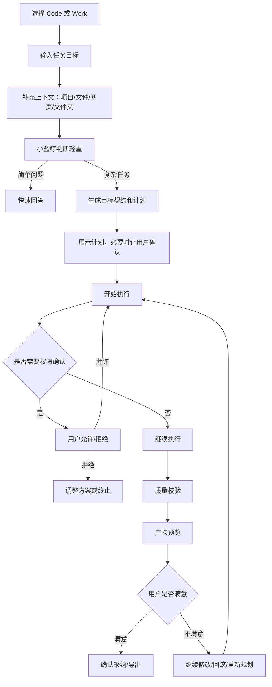

# 小蓝鲸桌面端 · 用户任务流程说明

> 状态：开工前产品视角文档（2026-06-30）
> 性质：从用户角度说明任务怎么发起、怎么看过程、怎么处理确认、怎么查看结果。研发状态机见 04，UI 线框见 08。
> 参考启发：WorkBuddy 的创建任务/任务管理/任务对话/结果查看，ZCode 的确认流程。

---

## 一、用户完成一个任务的完整流程

---

## 二、创建任务

### 用户需要做什么

1. 选择工作台：Code 或 Work。
2. 输入目标：一句话描述要做什么。
3. 补充上下文：
   - Code：选择项目目录、当前文件、报错信息。
   - Work：选择文件、文件夹、网页链接、表格。
4. 点击开始。

### 小蓝鲸要做什么

- 简单问题直接回答，不强制进入长任务。
- 复杂任务生成目标契约：目标、约束、不做什么、交付物、验收标准。
- 大改动先展示计划，用户确认后再执行。

---

## 三、任务执行中，用户看到什么

| 区域 | 展示内容 | 目的 |
|---|---|---|
| 中间主区域 | 当前步骤、思考摘要、正在读/改/跑什么 | 让用户知道它没卡住 |
| 右侧详情 | 目标契约、任务计划、工具日志、权限记录、校验结果、记忆引用 | 让用户能审查过程 |
| 底部输入区 | 暂停、回滚、重新规划、追加要求、解释当前步骤 | 让用户随时介入 |

**关键体验原则**：长任务不能黑盒跑。用户至少要知道：现在在做哪一步、用了什么工具、接下来要做什么、有没有风险。

---

## 四、任务卡住时怎么办

| 情况 | 用户看到什么 | 用户可选动作 |
|---|---|---|
| 等待权限 | 任务列表显示“等待确认” | 允许/拒绝/查看详情 |
| 工具失败 | 显示失败原因和已尝试动作 | 重试/换方案/放弃 |
| 跑偏 | 用户觉得方向不对 | 暂停/重新规划/追加要求 |
| 输出不满意 | 产物预览不合格 | 继续修改/回滚/重新生成 |
| 风险太高 | 弹窗说明影响 | 拒绝/改用低风险方案 |

---

## 五、结果查看

### Code 结果

必须展示：
- 修改摘要。
- 修改文件列表。
- 关键 Diff。
- 测试命令和测试结果。
- 风险说明。
- 下一步：继续修改、回滚、生成提交说明、commit（高风险需确认）。

### Work 结果

必须展示：
- 报告/草稿/表格结果。
- 关键结论和来源。
- 不确定信息和待确认事项。
- 是否修改原文件，是否生成副本。
- 下一步：复制、导出、写入文件、继续润色、发送前确认。

---

## 六、任务管理

任务列表至少支持：

| 状态 | 用户理解 |
|---|---|
| 进行中 | 小蓝鲸正在执行 |
| 等待确认 | 需要用户做决定 |
| 已暂停 | 用户暂停了，可继续 |
| 已完成 | 有结果可查看 |
| 失败 | 没完成，有原因和可重试入口 |

任务可按状态筛选。重启应用后任务列表不丢。

---

## 七、三条用户体验红线

1. **不能黑盒**：长任务必须显示过程。
2. **不能偷偷改**：写文件/执行命令/外发操作必须符合权限规则。
3. **不能交付不可查的结果**：Code 必须有 Diff/测试，Work 必须有来源/不确定项。

---

## 八、本文档边界

- 不定底层状态机值（见 04）。
- 不定 UI 线框（见 08）。
- 不定权限判定规则（见 05 与 12）。
