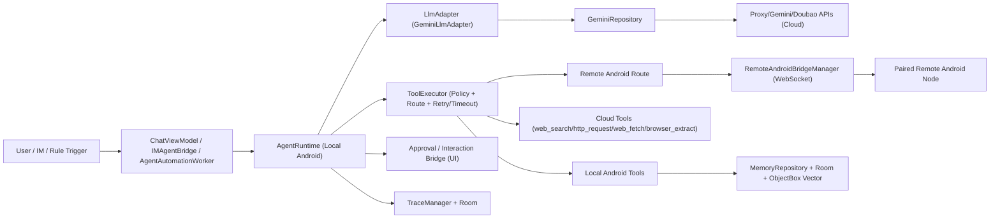
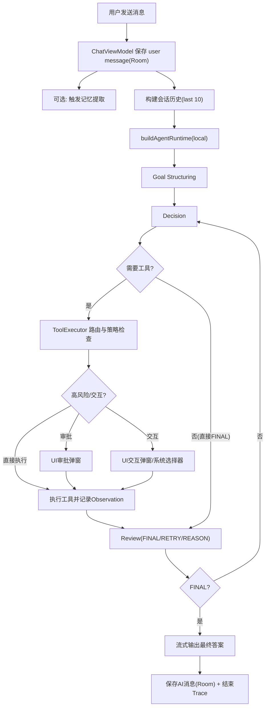

# Agent Runtime 技术结构与数据流分析

> 分析时间：2026-03-23  
> 分析范围：当前仓库 Android 主工程（源码静态分析）  
> 核心结论先说：**当前 Agent loop/runtime 运行在手机本地**；但模型推理与部分联网能力依赖云端。

---

## 1. 回答你的核心问题

是的，你说的方向是对的：  
**本项目的 Agent loop / runtime 主执行环境在手机本地（Android App 内）。**

但它是“本地编排 + 云端模型/联网能力”的混合架构，不是纯离线本地大模型架构。

---

## 2. 当前项目整体架构与技术栈总览

## 2.1 分层架构

| 层 | 主要模块 | 作用 |
|---|---|---|
| UI 层 | `ChatPage`, `ChatViewModel` | 用户输入、执行步骤展示、审批/交互弹窗 |
| Agent 编排层 | `AgentRuntime`, `LlmAdapter`, `ToolExecutor` | Goal-Plan-Act-Review 循环编排与收敛 |
| Tool 能力层 | `AndroidToolRegistry` + `agent/tools/*` | 本地系统能力、联网能力、远端桥接能力 |
| 数据与状态层 | Room + ObjectBox + Repository | 会话、消息、记忆、自动化、trace、remote 元数据 |
| 后台执行层 | WorkManager + Worker | 定时任务/规则触发任务 |
| 跨端桥接层 | `RemoteAndroidBridgeManager` | WebSocket 远端 Android 工具执行 |
| 模型与网络层 | `GeminiRepository`, `ProxyApiService`, Doubao Embedding | LLM 推理、联网检索、向量生成 |

## 2.2 技术栈（按源码）

| 类别 | 技术 |
|---|---|
| 平台 | Android (minSdk 24, targetSdk 36) |
| 语言 | Kotlin |
| UI | Jetpack Compose |
| 架构 | MVVM + Repository |
| 并发 | Kotlin Coroutines + Flow |
| 本地数据库 | Room (SQLite) |
| 向量库 | ObjectBox HNSW (`FaissVectorStoreService`) |
| 网络 | OkHttp |
| 后台调度 | WorkManager |
| AI 调用 | Gemini/Proxy/Doubao 等兼容链路 |
| 浏览器运行时 | `BrowserRuntimeManager`（本地会话） |

---

## 3. 当前项目技术结构图

---

## 4. Agent loop 是怎么实现的

核心实现位于 `app/src/main/java/com/xiaoxiami/app/agent/AgentRuntime.kt`。

## 4.1 主循环流程

| 阶段 | 说明 |
|---|---|
| Goal Structuring | `structureGoal`：将用户目标结构化 |
| Iteration Loop | `for (iteration in 1..maxIterations)`，默认上限 4 |
| Decision | `decideNextAction`：决定 `TOOL` 或 `FINAL` |
| Tool Resolve | `resolveTool(plannerName, routePreference)` 路由工具 |
| Approval/Interaction | 高风险审批、交互工具通过 UI 桥接 |
| Execute | `toolExecutor.execute` 执行并记录 observation |
| Review | `review` 返回 `FINAL/REASON/RETRY` |
| Finalization | 收敛后 `streamFinalAnswer`，否则上限后 fallback final |

## 4.2 事件驱动

`AgentRuntime` 会流式发出 `AgentEvent`（RunStarted/Thinking/ToolCallPlanned/ReviewCompleted/FinalAnswerChunk/Completed/Error），UI 根据事件实时渲染“执行步骤卡片”。

---

## 5. 执行环境：本地 vs 云端，分别做什么，为什么

## 5.1 责任拆分

| 位置 | 主要职责 | 原因 |
|---|---|---|
| 本地 Android | runtime loop、工具路由与策略、权限校验、审批、用户交互、数据落库、trace | Android 系统能力与权限控制天然在本地进程 |
| 云端 API | LLM 推理、联网搜索/抓取、部分模型代理与中转 | 模型算力与外网知识天然在云端 |
| 远端 Android 节点（可选） | 被桥接执行远程工具 | 提供跨设备扩展能力 |

## 5.2 关键路由策略

`ToolExecutor` 默认优先级：  
`LOCAL_ANDROID > CLOUD_SERVICE > REMOTE_ANDROID > LOCAL_DESKTOP > REMOTE_DESKTOP`

---

## 6. MCP / Skills / Tools 总量统计

> 统计口径说明：  
> - “可确定数”来自源码静态计数。  
> - “运行时总数”包含动态路由生成，受策略与状态影响。

## 6.1 MCP

| 项目 | 数量 | 说明 |
|---|---:|---|
| MCP 运行时接入 | **0** | 当前 Android Agent 主链路未接入 MCP runtime/adapter；仅文档与技能文本提及 MCP 概念 |

## 6.2 Skills

| 项目 | 数量 | 来源 |
|---|---:|---|
| Runtime 硬编码 bundled skills | **10** | `BundledSkills.manifests` |
| APK assets bundled skills | **28** | `app/src/main/assets/bundled-skills/*` |
| `.agent/skills`（开发侧） | **3** | `android-expert`, `code-reviewer`, `skill-creator` |

## 6.3 Tools

| 项目 | 数量 | 说明 |
|---|---:|---|
| `AndroidToolRegistry` 基础注册工具（baseTools） | **132** | 明确写在 registry 列表中 |
| 动态远端转发工具（remote forwarding routes） | **约 73** | 由 `buildRemoteAndroidForwardingTools` 按规则从本地工具动态派生 |
| 运行时总工具路由（估算） | **约 205** | 132 + 约73；实际可见/可用数受 policy/allowlist/连接状态影响 |
| `plannerVisible=false` 工具 | **1** | `remote_android_call_peer_tool`（隐藏，不直接给 planner） |

---

## 7. 记忆与上下文管理

## 7.1 短期上下文（会话内）

| 机制 | 实现 |
|---|---|
| 会话历史窗口 | 取最近 10 条非空消息作为 `conversationHistory` |
| 消息持久化 | Room `chat_messages` |
| 会话持久化 | Room `chat_sessions` |

## 7.2 长期记忆

| 机制 | 实现 |
|---|---|
| 记忆主存 | Room `long_term_memory_entries` |
| 记忆类型 | FACT / PREFERENCE / DECISION / LESSON |
| 检索 | 语义检索优先（Embedding + HNSW），失败回退关键词检索 |
| 工具接口 | `memory_search`, `memory_store`, `memory_forget` |
| 自动提取 | 发消息后按关键词触发 `extractImportantMemory` |

## 7.3 向量与检索链路

| 环节 | 实现 |
|---|---|
| Embedding 生成 | `DoubaoEmbeddingService`（2048维） |
| 向量存储 | ObjectBox `MemoryVector` + HNSW |
| 检索回放 | 命中后回写 usageCount/lastUsedAt |

## 7.4 可观测性（Trace）

| 机制 | 实现 |
|---|---|
| Run 级 | `trace_runs` |
| Span 级 | `trace_spans` |
| Artifact 级 | `trace_artifacts` |
| 记录内容 | goal/reason/tool/review/final 各阶段状态与摘要 |

---

## 8. 当前能力边界：能做什么，不能做什么

## 8.1 能做的

- 本地设备数据与系统能力：通知、日历、联系人、短信、通话、位置、文件、媒体、部分设备控制。
- 浏览器任务：打开页面、提取网页、浏览器会话多步操作、下载、上传（需交互）。
- 自动化任务：定时任务 + 通知规则触发（WorkManager）。
- 跨设备扩展：通过 remote bridge 调用远端 Android 节点工具。

## 8.2 明确受限或不能做的

| 边界 | 当前状态 |
|---|---|
| Accessibility 通用 UI 自动化 | **未接入**（Manifest/代码无 `AccessibilityService` 路径） |
| Settings 类工具 | 是 `SETTINGS_REDIRECT`，只能拉起设置页，不是静默改开关 |
| 后台自动化中的高风险工具 | 默认拒绝（Worker 审批 handler 明确拒绝） |
| IM 渠道交互型工具 | 不支持（IM 无文件选择/拍照/截屏交互桥） |
| Shell 执行 | 默认不可用（`NoopShellRuntime`） |
| MCP-first 主干 | 当前不是，runtime 主干是本地函数工具体系 |

---

## 9. 一次完整任务的端到端流程

## 9.1 流程说明

1. 用户发送消息（可携带图片）。  
2. 写入 Room（user message/session 更新）。  
3. 可选触发长期记忆提取。  
4. 构建会话上下文（最近 10 条）。  
5. 本地组装 `AgentRuntime`（tool policy + approval/interaction + trace + skills）。  
6. 执行 loop：Goal -> Decision -> Tool -> Observation -> Review（可能多轮）。  
7. 收敛后流式输出最终答案（chunk）。  
8. 落库 AI 最终消息，收尾 trace。  

## 9.2 用户使用路径数据流图

---

## 10. 自动化与 IM 侧路径补充

## 10.1 自动化（Schedule/Rule）

| 触发源 | 执行方式 | 限制 |
|---|---|---|
| 定时任务 | `AgentAutomationWorker` 调用同一 `AgentRuntime` | `ToolPolicy.automation`，审批工具拒绝 |
| 通知规则 | `AgentNotificationListenerService` 命中规则后入队 Worker | 支持 CONFIRM/AUTO/DISABLED、冷却与限流 |

## 10.2 IM 网关

| 项目 | 说明 |
|---|---|
| 接入平台 | Telegram/Feishu/Dingtalk/Wecom/Discord/QQ/Weixin |
| 会话映射 | 按 `platform:senderId` 建立会话 |
| 工具策略 | `ToolPolicy.remoteOperator()`（受限） |
| 审批策略 | 高风险默认拒绝，低中风险自动通过 |
| 交互工具 | 不支持 |

---

## 11. 源码定位索引（关键文件）

- Agent loop：`app/src/main/java/com/xiaoxiami/app/agent/AgentRuntime.kt`
- Tool 执行与策略：`app/src/main/java/com/xiaoxiami/app/agent/ToolExecutor.kt`
- Tool 协议与 Policy：`app/src/main/java/com/xiaoxiami/app/agent/Tool.kt`
- Tool 注册：`app/src/main/java/com/xiaoxiami/app/agent/AndroidToolRegistry.kt`
- 远端路由工具生成：`app/src/main/java/com/xiaoxiami/app/agent/tools/RoutedRemoteAndroidTools.kt`
- Chat 侧 runtime 装配：`app/src/main/java/com/xiaoxiami/app/viewmodel/ChatViewModel.kt`
- App 启动装配：`app/src/main/java/com/xiaoxiami/app/MyApplication.kt`
- 记忆仓库：`app/src/main/java/com/xiaoxiami/app/repository/MemoryRepository.kt`
- 数据库：`app/src/main/java/com/xiaoxiami/app/data/MemoryDatabase.kt`
- 向量检索：`app/src/main/java/com/xiaoxiami/app/service/FaissVectorStoreService.kt`
- 远端桥：`app/src/main/java/com/xiaoxiami/app/remote/RemoteAndroidBridgeManager.kt`
- 自动化 Worker：`app/src/main/java/com/xiaoxiami/app/worker/AgentAutomationWorker.kt`
- IM Bridge：`app/src/main/java/com/xiaoxiami/app/im/IMAgentBridge.kt`
- 权限与组件：`app/src/main/AndroidManifest.xml`
- 架构路线文档：`docs/mobile-agent-roadmap.md`

---

## 12. 一句话总结

当前项目是典型的 **Mobile Agent Runtime（本地编排执行）+ Cloud LLM（推理与联网）+ Optional Remote Bridge（跨端执行）** 的三段式架构；本地不是 MCP-first，而是以 Android 原生工具函数体系为主干。

