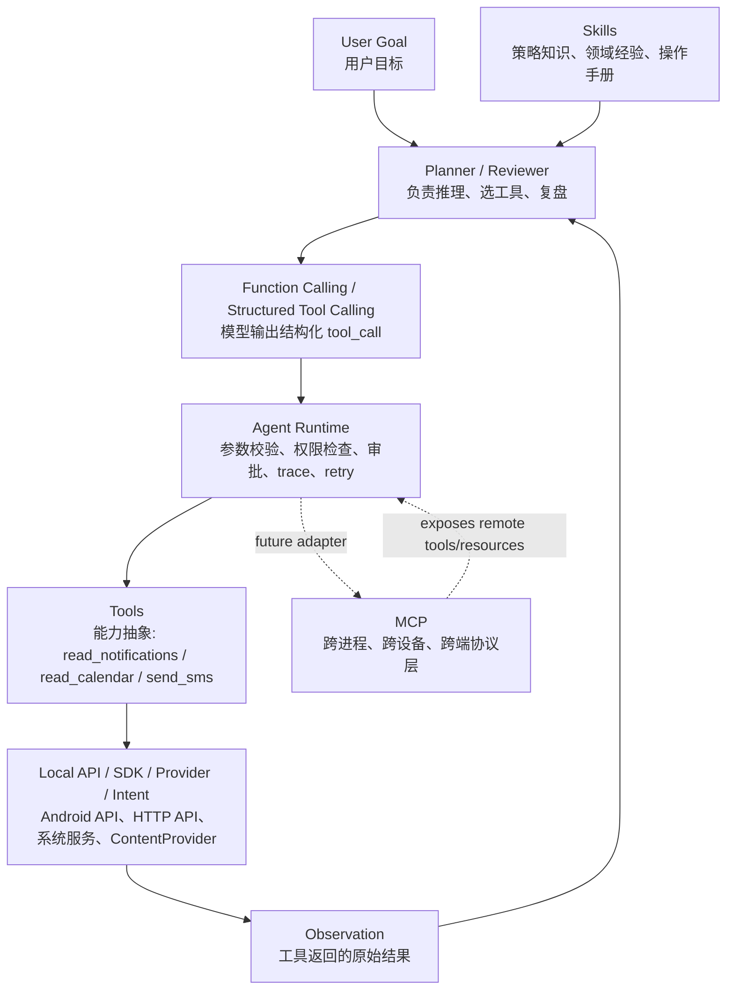

# Mobile Agent Roadmap

## 1. 目标

构建一个侧载分发的 Android Agent 应用，在不依赖以下能力的前提下，做到尽可能强的系统级能力：

- 不使用无障碍权限
- 不使用 Root
- 不使用悬浮窗权限

允许使用：

- 普通危险权限
- 特殊访问授权
- MediaProjection 屏幕捕获授权
- Notification access
- Usage access
- 通讯录 / 日历 / 电话 / 短信 / 位置 / 相机 / 麦克风 / 媒体 / 文件等权限

这意味着产品上追求的是：

- 最强的非侵入式手机 Agent
- 最强的设备感知能力
- 最强的个人数据与通信能力
- 最强的审批、审计、回放能力

但不追求：

- 任意跨 App UI 点击输入滚动
- 静默系统设置控制
- 静默安装卸载
- 任意读取其他 App 私有 UI 结构

## 2. 当前项目现状

当前代码已经具备最小 Agent runtime 主干：

- `AgentRuntime`
- `LlmAdapter`
- `ToolExecutor`
- `Review`
- `Trace`

当前模型调用方式是：

- 先结构化 Goal
- 再让模型决定下一步动作
- 再执行 Tool
- 再做 Review
- 最后生成 Final Answer

当前形态已经是 Agent 雏形，但 tool 数量和 tool schema 还远远不够。

## 3. 总体原则

### 3.1 工具设计原则

- 每个 tool 只做一件事
- tool 输入输出必须结构化
- tool 自身不做复杂决策
- tool 只返回 observation，不直接包装用户态答案
- 高风险 tool 必须审批
- 所有 tool 必须 trace

### 3.2 能力建设顺序

- P0：系统感知 + 个人数据读取 + 低风险执行
- P1：通信执行 + 采集录入 + 文件/设备控制
- P2：高级通知动作 + 媒体控制 + 批量任务 + 安装卸载

### 3.3 风险分级

- `low`: 查询、跳转、草稿、用户主动选择
- `sensitive`: 读取隐私数据、截屏、录音、媒体读取
- `high`: 发短信、打电话、改联系人、批量写入、安装卸载

## 4. P0 Tool 表

| Tool | 作用 | 输入 schema | 输出 schema | 权限/授权 | 审批级别 |
|---|---|---|---|---|---|
| `get_foreground_app` | 获取当前前台 App | `{}` | `{packageName, appName, lastActiveAt, confidence}` | `PACKAGE_USAGE_STATS` | `low` |
| `read_notifications` | 读取最近通知 | `{limit?, packageNames?, sinceMs?}` | `{items:[{key, packageName, title, text, postTime, actionsCount}]}` | Notification access | `sensitive` |
| `dismiss_notification` | 清除通知 | `{notificationKey}` | `{success}` | Notification access | `high` |
| `capture_current_screen` | 截屏 | `{reason?}` | `{imageUri, width, height, capturedAt}` | MediaProjection | `sensitive` |
| `analyze_current_screen` | 理解当前屏幕 | `{goal, focusHint?}` | `{summary, visibleTexts, uiClues, risks}` | 依赖截屏 | `sensitive` |
| `read_calendar` | 查询日程 | `{startAt, endAt, keywords?, calendarIds?}` | `{events:[...]}` | `READ_CALENDAR` | `sensitive` |
| `create_calendar_event` | 创建日程 | `{title, startAt, endAt, location?, notes?, reminderMinutes?}` | `{eventId, created}` | `WRITE_CALENDAR` | `high` |
| `search_contacts` | 搜索联系人 | `{query, limit?}` | `{contacts:[...]}` | `READ_CONTACTS` | `sensitive` |
| `get_contact_detail` | 联系人详情 | `{contactId}` | `{contactId, displayName, phones, emails, company?, notes?}` | `READ_CONTACTS` | `sensitive` |
| `get_current_location` | 获取位置 | `{}` | `{address, latitude, longitude, accuracy?}` | `ACCESS_COARSE/FINE_LOCATION` | `high` |
| `search_local_media` | 搜图片/视频/音频 | `{type, query?, fromTime?, toTime?, limit?}` | `{items:[...]}` | `READ_MEDIA_*` | `sensitive` |
| `pick_images` | 选图片 | `{maxCount?}` | `{items:[...]}` | 用户选择 | `low` |
| `pick_files` | 选文件 | `{mimeTypes?, multiple?}` | `{items:[...]}` | 用户选择 | `low` |
| `open_app` | 打开 App | `{packageName}` | `{success, launchedPackage}` | 无 | `low` |
| `open_deeplink` | 打开 deeplink | `{uri}` | `{success}` | 目标 App 处理 | `low` |
| `open_system_settings_page` | 打开系统设置页 | `{page}` | `{success}` | 无 | `low` |
| `share_text` | 分享文本 | `{text, title?, targetPackage?}` | `{success}` | 无 | `low` |
| `share_files` | 分享文件 | `{uris, text?, targetPackage?}` | `{success}` | URI grant | `sensitive` |
| `read_clipboard` | 读剪贴板 | `{}` | `{text, hasContent}` | 前台可读 | `sensitive` |
| `write_clipboard` | 写剪贴板 | `{text, label?}` | `{success}` | 无 | `low` |

## 5. P1 Tool 表

| Tool | 作用 | 输入 schema | 输出 schema | 权限/条件 | 审批级别 |
|---|---|---|---|---|---|
| `draft_sms` | 生成短信草稿 | `{to, body}` | `{intentReady}` | `ACTION_SENDTO` | `low` |
| `send_sms_confirmed` | 直接发短信 | `{to, body, simSlot?}` | `{success, messageId?, sentAt}` | `SEND_SMS` | `high` |
| `read_sms_threads` | 读短信会话 | `{limit?, address?, sinceMs?}` | `{threads:[...]}` | `READ_SMS` | `high` |
| `read_sms_messages` | 读短信内容 | `{threadId?, address?, limit?, sinceMs?}` | `{messages:[...]}` | `READ_SMS` | `high` |
| `dial_number` | 打开拨号盘 | `{number}` | `{success}` | `ACTION_DIAL` | `low` |
| `place_call_confirmed` | 直接拨号 | `{number}` | `{success, startedAt}` | `CALL_PHONE` | `high` |
| `read_call_log` | 读取通话记录 | `{limit?, number?, sinceMs?, type?}` | `{calls:[...]}` | `READ_CALL_LOG` | `high` |
| `create_contact` | 新建联系人 | `{name, phones?, emails?, company?}` | `{contactId, created}` | `WRITE_CONTACTS` | `high` |
| `update_contact` | 更新联系人 | `{contactId, patch}` | `{success}` | `WRITE_CONTACTS` | `high` |
| `delete_contact_confirmed` | 删除联系人 | `{contactId}` | `{success}` | `WRITE_CONTACTS` | `high` |
| `camera_capture` | 拍照 | `{saveTo?, purpose?}` | `{imageUri, capturedAt}` | `CAMERA` | `sensitive` |
| `record_audio` | 录音 | `{maxDurationSec?, purpose?}` | `{audioUri, durationSec}` | `RECORD_AUDIO` | `sensitive` |
| `transcribe_audio` | 转写音频 | `{audioUri}` | `{text, segments?}` | 文件/录音输入 | `sensitive` |
| `save_file_to_downloads` | 保存到下载目录 | `{displayName, mimeType, text? or sourceUri}` | `{uri, saved}` | SAF / MediaStore | `sensitive` |
| `open_file_with_app` | 用外部 App 打开文件 | `{uri, mimeType?}` | `{success}` | URI read grant | `low` |
| `query_battery_status` | 查询电池状态 | `{}` | `{level, charging, temperature?, health?}` | 无或普通权限 | `low` |
| `query_storage_status` | 查询存储空间 | `{}` | `{freeBytes, totalBytes, usedBytes}` | 无 | `low` |
| `query_network_status` | 查询网络状态 | `{}` | `{connected, transport, metered?, roaming?}` | `ACCESS_NETWORK_STATE` | `low` |
| `launch_map_navigation` | 导航 | `{destination, mode?}` | `{success}` | 地图 App / Intent | `low` |
| `create_local_reminder` | 本地提醒 | `{title, triggerAt, body?}` | `{reminderId, scheduled}` | 通知权限 | `high` |

## 6. P2 Tool 表

| Tool | 作用 | 输入 schema | 输出 schema | 权限/条件 | 审批级别 |
|---|---|---|---|---|---|
| `reply_to_notification` | 回复通知 | `{notificationKey, text}` | `{success}` | Notification access + RemoteInput | `high` |
| `trigger_notification_action` | 触发通知按钮 | `{notificationKey, actionIndex}` | `{success}` | Notification access + action 存在 | `high` |
| `snooze_notification` | 暂停通知 | `{notificationKey, durationMs}` | `{success}` | Notification access | `sensitive` |
| `media_session_list` | 列出媒体会话 | `{}` | `{sessions:[...]}` | Notification access | `sensitive` |
| `media_play_pause` | 播放/暂停媒体 | `{packageName?}` | `{success}` | Media session | `high` |
| `media_next_previous` | 上下曲/上下集 | `{packageName?, action}` | `{success}` | Media session | `high` |
| `set_stream_volume` | 调整音量 | `{stream, level}` | `{success}` | `MODIFY_AUDIO_SETTINGS` | `high` |
| `get_audio_output_devices` | 音频输出设备 | `{}` | `{devices:[...]}` | 蓝牙场景可能需 `BLUETOOTH_CONNECT` | `sensitive` |
| `install_apk_prompted` | 发起 APK 安装 | `{apkUri}` | `{promptLaunched}` | `REQUEST_INSTALL_PACKAGES` + 用户允许未知来源 | `high` |
| `uninstall_app_prompted` | 发起 App 卸载 | `{packageName}` | `{promptLaunched}` | 系统确认页 | `high` |
| `app_usage_report` | App 使用分析 | `{fromTime, toTime, packageNames?}` | `{apps:[...]}` | `PACKAGE_USAGE_STATS` | `sensitive` |
| `sms_history_analysis` | 短信历史分析 | `{fromTime, toTime, address?}` | `{summary, stats, threads}` | `READ_SMS` | `high` |
| `call_history_analysis` | 通话历史分析 | `{fromTime, toTime, number?}` | `{summary, stats, contacts}` | `READ_CALL_LOG` | `high` |
| `bulk_calendar_import_confirmed` | 批量创建日程 | `{events:[...]}` | `{createdCount, failedCount}` | `WRITE_CALENDAR` | `high` |
| `bulk_contact_import_confirmed` | 批量导入联系人 | `{contacts:[...]}` | `{createdCount, failedCount}` | `WRITE_CONTACTS` | `high` |
| `bulk_sms_send_confirmed` | 批量发短信 | `{messages:[...]}` | `{sentCount, failedCount}` | `SEND_SMS` | `high` |
| `search_global_device_index` | 全局搜索设备内容 | `{query, scopes}` | `{hits:[...]}` | 组合权限 | `high` |

## 7. Tool 调用架构怎么选

这是核心问题。需要先区分几个概念。

### 7.0 概念关系图

这张图要表达的是：

- `Tools` 是能力单元，不是协议
- `API` 是 tool 的底层实现
- `Function Calling` 是模型表达“我要调用哪个 tool”的结构化格式
- `Runtime` 负责真正落地执行控制，不让模型直接碰系统 API
- `Skills` 作用在 planner / reviewer，帮助模型更会想，不直接执行
- `MCP` 主要用于远端设备、桌面端、云端服务接入，不是当前本地 Android tool 主干

### 7.1 MCP

MCP 适合：

- 跨进程
- 跨机器
- 外部服务
- PC / Server / Browser / IDE / 外部 Agent 生态

MCP 不适合作为当前 Android 本地 tool 的第一主干：

- Android 本地能力不是天然 MCP server 形态
- 权限、Activity、ContentProvider、Service、Intent 都在本地进程里
- 用 MCP 包一层会增加协议复杂度和调用开销
- 对本地设备 tool 来说没有带来真正的泛化能力

结论：

- 本地 Android tool 不以 MCP 为主干
- 后续如果接电脑端、浏览器端、家庭设备端，再加 MCP adapter

### 7.2 Skills

Skills 适合：

- 提示词模板
- 任务策略
- 领域操作手册
- 长文本任务规范

Skills 不适合作为 tool 执行机制：

- skills 不是可执行接口
- skills 更像 planner 的知识补丁
- 它解决“怎么想”，不解决“怎么调系统能力”

结论：

- skills 可以作为 planner / reviewer 的外部策略包
- 不能作为 Android 本地 tool 的执行协议

### 7.3 传统 API / 普通函数调用

这是 Android 本地 tool 的最佳主干：

- Kotlin interface / class 最适合接权限和系统 API
- 易做参数校验
- 易做审批
- 易做 trace
- 易做失败重试
- 易做单元测试

但如果只是“硬编码 if-else 路由到函数”，泛化会很差。

所以不能停留在：

- 关键词命中
- 场景枚举
- 规则路由

### 7.4 原生 Function Calling / Structured Tool Calling

这是最符合 Agentic 能力目标的调用方式。

核心思想：

- tool 以普通 Kotlin 函数/接口实现
- 但暴露给模型的是结构化 tool schema
- 模型根据 Goal、History、Observation、Tool schema 自主决定调用哪个 tool
- 模型可以多轮调用
- Review 决定继续、重试、收敛

也就是说：

- **实现层**是普通函数调用
- **决策层**是模型驱动的 tool calling

这才是你要的“真正 agentic”，不是硬规则。

## 8. 推荐架构结论

### 8.1 第一阶段结论

- 本地 Android tool 主干继续使用 `ToolSchema + Runtime + Structured Tool Calling`
- 跨端执行通过 `host routing` 向 `LOCAL_ANDROID / REMOTE_ANDROID / LOCAL_DESKTOP / REMOTE_DESKTOP / CLOUD_SERVICE` 收口
- skills 升级成“可安装策略包”，兼容 `SKILL.md` 目录包，不只支持内置 JSON manifest
- browser 作为第二执行面接入 runtime，不把所有网页任务都退化成 web_search / web_fetch
- shell runtime 作为高风险可选执行面预留，但不默认暴露

## 9. Open Minis 启发映射

参考公开信息：

- [App Store - Open Minis](https://apps.apple.com/us/app/open-minis/id6759188481)
- [OpenMinis GitHub Org](https://github.com/OpenMinis)
- [MinisSkills](https://github.com/OpenMinis/MinisSkills)

我们只吸收这些思想，不复用对方代码：

1. 统一能力总线
2. skills 作为长期资产
3. browser 作为第二执行面
4. shell 作为受控的可选执行面

## 10. 当前已落地的 Open Minis 式改造

### 10.1 P0 已落地

- `ToolSchema` 新增 `family`，并可根据 scope/capability 推导 `effectiveFamily`
- planner 现在能看到逻辑工具的 `family + routes`
- 权限中心新增：
  - Agent 能力总线视图
  - 可选工具组视图
  - 继续保留 Android 权限/特殊访问/设备控制说明

### 10.2 P1 已落地

- 新增 `browser_open`
- 新增 `browser_extract`
- skills 兼容层新增本地 `SKILL.md` 包加载：
  - `files/skills/<skill-id>/SKILL.md`
  - 可选 `files/skills/<skill-id>/skill.json`

### 10.3 P2 已落地

- 新增 `ShellRuntime` 抽象
- 默认实现为 `NoopShellRuntime`
- 新增 `shell_exec` 可选 tool，默认不启用、未配置时也不会暴露

## 11. 下一步

最值得继续推进的是：

1. 给权限中心加可配置 allowlist，而不是只展示状态
2. 补浏览器更强的执行能力，如表单填写、页面元素抽取、会话上下文
3. 给 shell runtime 接真正的 Android 侧沙箱实现，或把它落到未来桌面端 host
4. 做 skills 管理页，支持启停、优先级、导入与删除

用下面这条路线：

1. Android 本地 tools 用 Kotlin 接口实现
2. 每个 tool 同时定义结构化 schema
3. LLM 不直接拿代码对象，而是看到 tool schema 列表
4. LLM 输出结构化 `tool_call`
5. Runtime 做参数校验、权限检查、审批、执行、trace
6. Tool 返回 observation
7. Review 决定继续 / retry / final

这就是：

- 不是 MCP-first
- 不是 skills-first
- 不是硬规则路由
- 而是 **schema-first 的模型驱动 tool calling**

### 8.2 第二阶段演进

短期：

- 继续沿用当前 `prompt -> JSON -> parse -> execute` 方式

中期：

- 把当前 `AgentDecision` 升级成标准化 `ToolCall`
- 引入参数 schema 校验器
- 引入 tool capability tags

长期：

- 如果底层模型 API 对原生 function calling 支持足够稳定，就切到原生 function calling
- 如果要接电脑端 / 云端 / 外部服务，再引入 MCP adapter

## 9. 跨端架构提前约束

后续会有：

- 手机端 Agent
- 桌面端 Agent
- 桌面端跨端控制手机

所以第一版就要避免把 tool 设计成“只适合单机 Android Activity 调用”的死结构。

建议架构：

### 9.1 三层

1. **Logical Tool Layer**
   - 统一的 tool name
   - 统一的 input/output schema
   - 统一的 risk / permission / capability metadata

2. **Runtime Execution Layer**
   - local function executor
   - remote bridge executor
   - future MCP adapter

3. **Device Registry Layer**
   - 当前手机
   - 远端手机
   - 当前桌面
   - 远端桌面
   - 云端服务

### 9.2 关键原则

- 逻辑 tool 和执行位置分离
- 一个 tool 先定义“做什么”，再定义“在哪个设备执行”
- planner 面向 schema 做决策，不面向具体 Android 类名
- runtime 再决定是本地执行、远端执行还是云端执行

### 9.3 当前阶段如何落

当前阶段先把 tool schema 中加入：

- host kind
- capability
- access requirements
- input schema
- output schema

这样后面桌面端进来时，不需要推翻 tool 层，只需要新增：

- desktop tool provider
- remote android bridge provider
- unified device registry

### 9.4 未来推荐形态

未来的统一执行链应当是：

- Planner 看到所有可用 tools
- 每个 tool 附带 host kind
- Planner 选择逻辑 tool
- Runtime 根据 host kind 路由：
  - `local_android`
  - `remote_android`
  - `local_desktop`
  - `remote_desktop`
  - `cloud_service`

这样手机端和桌面端会共用一套 agentic 逻辑，而不是两套各自为战的执行系统。

## 10. 为什么这条路泛化更强

泛化能力强，不是因为用了 MCP，也不是因为叫 skills。

泛化能力真正来自：

- 模型看到完整 tool schema，而不是关键词列表
- 模型基于目标、上下文、observation 自主选工具
- 模型可多轮行动，而不是一次匹配
- 有 review，不是一步执行完就结束
- tool 是原子能力，组合由模型决定
- 权限、审批、trace 都在 runtime 层，而不是写死在 prompt 里

换句话说：

- **MCP 解决的是协议互联**
- **skills 解决的是策略知识**
- **agentic tool calling 解决的是自主决策与执行**

你的核心应该放在第三个。

## 11. P0 开始怎么落

建议从这 6 步开始：

1. 把现有 `Tool` 升级成 `Tool + ToolSchema`
2. 增加统一参数校验层
3. 增加权限检查层与授权状态缓存
4. 实现前 6 个 P0 tool：
   - `get_foreground_app`
   - `read_notifications`
   - `capture_current_screen`
   - `analyze_current_screen`
   - `read_calendar`
   - `search_contacts`
5. 增加特殊访问引导页：
   - Notification access
   - Usage access
   - MediaProjection 引导
6. 在聊天 UI 里展示 tool 调用和审批过程

## 12. 当前项目上的直接结论

当前项目已经有一个可用的 Agent 雏形，但还停留在：

- 自定义 prompt
- 自定义 JSON 决策
- tool schema 还不够完整

所以接下来不应该做的，是：

- 把本地 tools 全改成 MCP
- 搞一套 skills 运行时
- 写更多硬规则路由

接下来应该做的，是：

- 保留现有 `AgentRuntime -> LlmAdapter -> ToolExecutor` 主干
- 给 tool 增加 schema、capability、permission、risk metadata
- 扩张 P0 tool 集合
- 强化 review 与审批

## 13. 最终决策

一句话结论：

**本地 Android Agent 的 tool 主干，应该是“普通函数实现 + 结构化 tool schema + 模型驱动 tool calling + review loop”，而不是 MCP-first，也不是 skills-first。**

## 14. 当前实现进度

截至目前，已经在当前项目里原生实现并接入 runtime 的能力：

- 第一批：
  - `memory_store`
  - `memory_forget`
  - `http_request`
  - `web_fetch`
  - `pdf_read`
  - `image_info`
- 第二批：
  - `schedule`
  - `cron_add`
  - `cron_list`
  - `cron_update`
  - `cron_delete`
  - `cron_run`
  - `cron_runs`
  - `rules_add`
  - `rules_list`
  - `rules_update`
  - `rules_delete`
- 第三批：
  - `delegate`

这批能力全部走当前项目自己的：

- `ToolSchema`
- `AgentRuntime`
- `ToolExecutor`
- `Review`
- `Trace`
- `WorkManager` / `Room`

没有直接复用外部项目实现代码。

## 15. Remote Android Bridge 预留架构

后续做桌面端和跨端控制手机时，不应把当前手机端 tools 推翻重做，而应新增一层桥接执行器。

建议未来增加以下抽象：

1. `Logical Tool`
   - 仍然是当前的 `ToolSchema`
   - 名称、输入输出、风险、权限元数据保持不变

2. `Execution Target`
   - `local_android`
   - `remote_android`
   - `local_desktop`
   - `remote_desktop`
   - `cloud_service`

3. `Remote Bridge Transport`
   - 只负责设备发现、鉴权、请求发送、结果回传
   - 不负责 planner 决策

4. `Remote Bridge Executor`
   - runtime 看见 `hostKind=remote_android` 后，把请求转发给 bridge
   - 本地和远端共用一套逻辑 tool name 与 schema

5. `Device Registry`
   - 管理当前手机、桌面端、远端手机、远端桌面的在线状态与能力清单

这条路的好处是：

- 手机和桌面共用一套 tool 语义
- planner 不需要知道“这是本地手机还是远端手机”
- 后续加 MCP，也是在 bridge/adapter 层加，而不是改写本地 Android tool

## 16. 本轮新增架构

本轮已经把下面 5 个基础能力接进当前项目主干：

- `rules` 升级为 `confirm / auto / disabled`
- `rules_runs / rules_preview`
- `optional tools + allowlist`
- `remote_android_bridge` 协议、设备注册表、请求超时表
- `SkillManifest + gating`

同时把安全模型升级成 4 层：

1. `identity`
   - `USER_INTERACTIVE`
   - `AUTOMATION`
   - `DELEGATED_AGENT`
   - `REMOTE_OPERATOR`

2. `scope`
   - 例如 `MEMORY / NETWORK / AUTOMATION / REMOTE_BRIDGE / DOCUMENT`

3. `tool risk`
   - `LOW / SENSITIVE / HIGH`

4. `content risk`
   - 例如 `UNTRUSTED_NETWORK_CONTENT / SENSITIVE_PERSONAL_DATA / REMOTE_DEVICE_PAYLOAD`

当前执行策略是：

- `ToolExecutor` 在 planner 看见工具之前就先按 policy 过滤
- `optional` 工具必须经过 allowlist
- 高风险工具默认自动归入 `optional/high_risk`
- 远端和桌面工具默认自动归入 `optional/remote_android` 或 `optional/desktop`
- 后台 automation 和 delegate 使用更严格的 policy

这意味着现在的 Agent 不是只靠“审批弹窗”做安全，而是先做：

- 身份隔离
- 范围隔离
- 风险分层
- 内容风险隔离

然后才在允许的边界内走审批。

## 17. Remote Bridge 当前状态

当前 `remote_android_bridge` 已经不只是协议草图，而是具备最小可运行链路：

- `RemoteBridgeConfigStore`
  - 保存 `bridgeUrl / pairingCode / localDeviceId / localDisplayName / sessionToken`
- `RemoteAndroidBridgeManager`
  - `OkHttp WebSocket` 传输层
  - `HELLO` 配对握手
  - 心跳
  - 失败重连
  - 入站 `TOOL_REQUEST`
  - 出站 `TOOL_RESPONSE`
  - 出站 `sendToolRequest`
- `RemoteBridgeRepository`
  - 设备注册表
  - request/response/timeout 表
- `PermissionCenter`
  - 现在可以直接配置 bridge URL、pairing code、连接/断开、查看已登记节点

当前约束：

- 远端入站请求默认只允许 `remote_operator policy` 可见的工具
- 高风险工具仍然不会被远端静默执行
- `USER_INTERACTION` 类型工具不会通过 bridge 自动执行
- 这条链现在已经适合作为“桌面端控制手机”的移动节点基础
